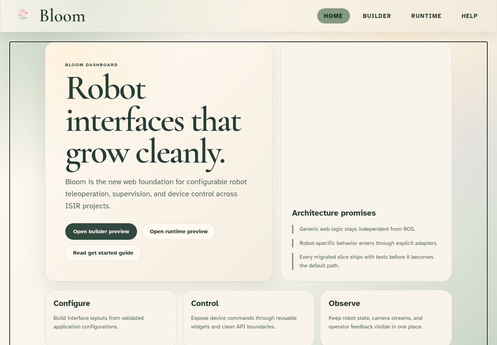
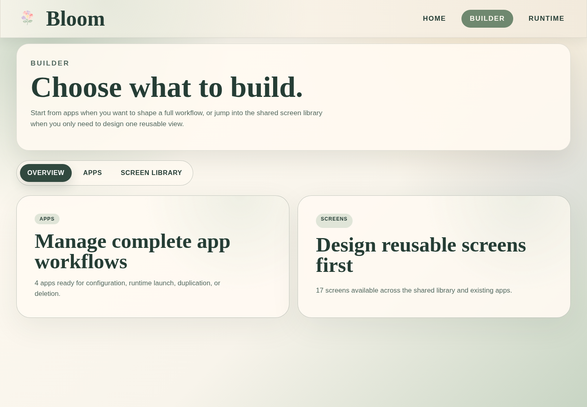
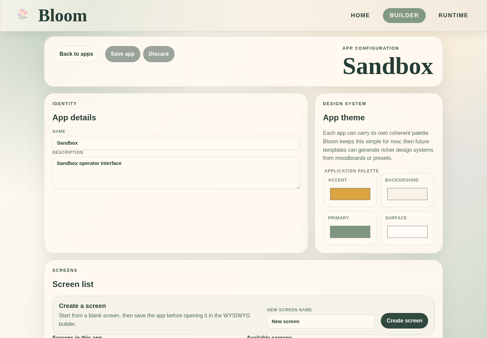
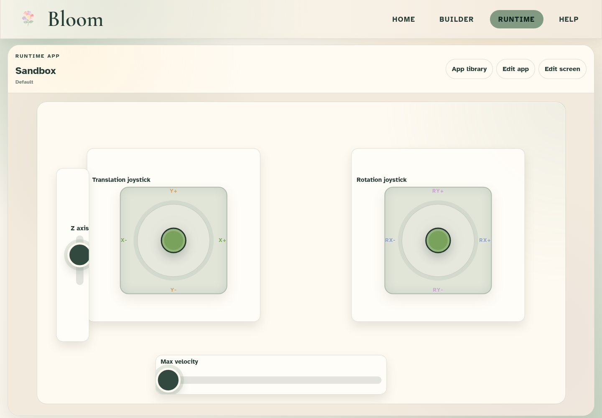
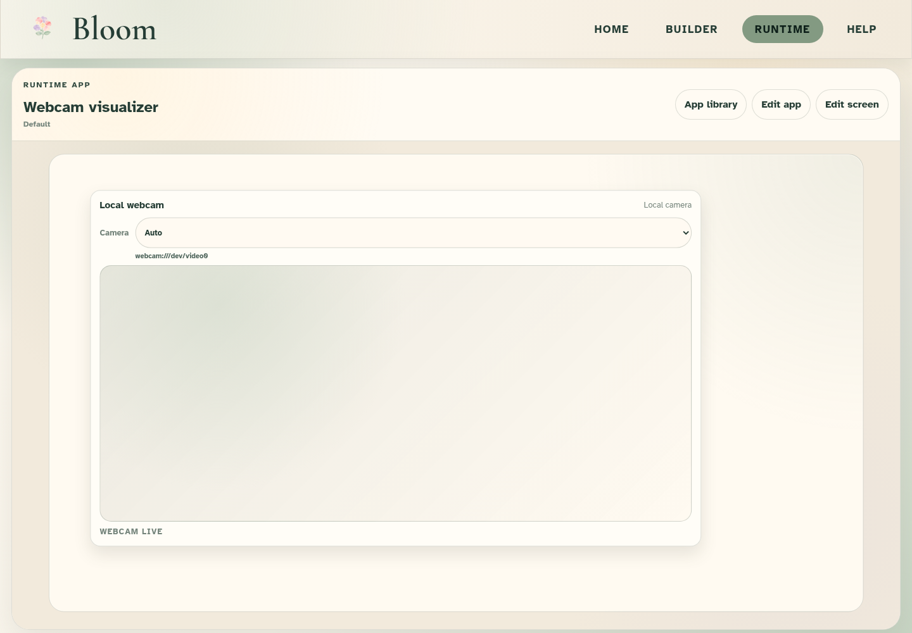
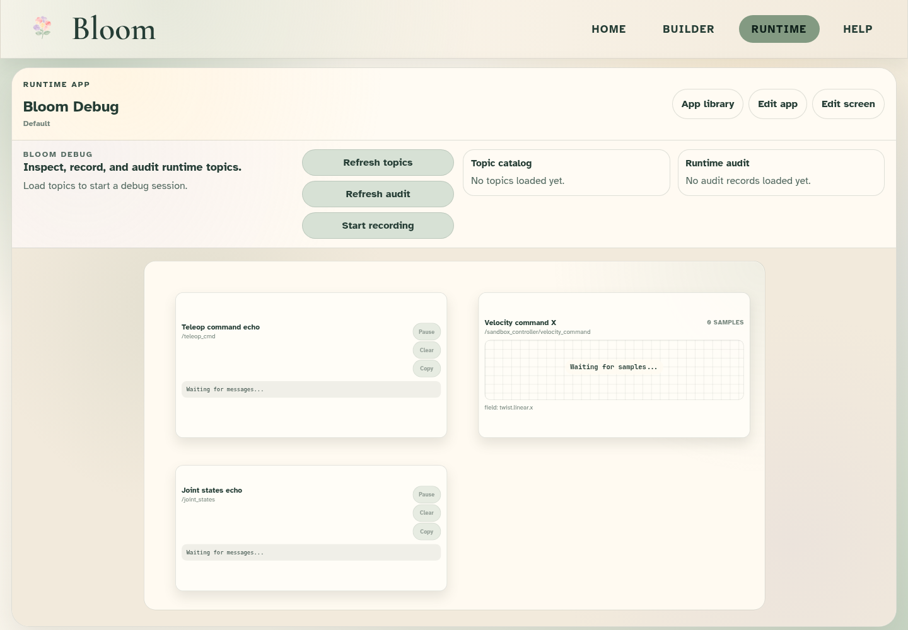

<p align="center">
  
</p>

<p align="center">
  Configurable web interfaces for robot teleoperation, supervision, debugging, and device control.
</p>

<p align="center">
  <a href="LICENSE"></a>
  
  
  
</p>

<p align="center">
  <a href="#preview">Preview</a> ·
  <a href="#current-state">State</a> ·
  <a href="#getting-started">Getting Started</a> ·
  <a href="#architecture">Architecture</a> ·
  <a href="#testing">Testing</a> ·
  <a href="#documentation">Docs</a>
</p>

Bloom is a product-style monorepo for building robot and machine-operation web apps. It combines a React dashboard,
a FastAPI backend, reusable widget contracts, runtime safety policies, and optional ROS 2 adapters.

Bloom started from the Extender tablet interface migration, but it is intentionally not an Extender-only project. A lab
workspace can use Bloom with ROS, HTTP, WebSocket, MQTT, C++ gateways, or future adapter layers while keeping the same
builder, runtime, screens, widgets, themes, and storage model.

## Preview

| Landing | Builder | App configuration |
| --- | --- | --- |
|  |  |  |

| Live teleop | Camera runtime | Bloom Debug |
| --- | --- | --- |
|  |  |  |

Refresh the screenshots from a running dashboard:

```bash
BLOOM_DASHBOARD_URL=http://127.0.0.1:5173 npm run capture:readme
```

## Current State

Bloom is now a usable foundation for the Extender/Petanque migration and robot-interface experiments:

- Visual builder for apps, reusable screens, WYSIWYG canvas layouts, widget palettes, app themes, and runtime policies.
- Runtime app library with clean operator views, recent app shortcuts, edit shortcuts, and tablet-friendly canvas fitting.
- Reusable widgets for teleop joysticks, sliders, commands, camera/webcam, labels, gauges, plots, event logs, gestures,
  robot-3D placeholders, topic echo, and Bloom Debug tools.
- Backend configuration API with JSON storage, SQLite storage, normalized mirror tables, import/export, and legacy JSON
  conversion helpers.
- Runtime API with WebSocket sessions, topic subscriptions, topic samples, teleop acknowledgements, audit records,
  command rate limits, recording hooks, and HTTP ROS topic publishing.
- ROS mode can publish Extender `TeleopCommand` messages on `/teleop_cmd`, publish generic ROS messages, and discover
  live ROS topics through the `rclpy` catalog adapter.
- CI covers backend tests, frontend tests, build, security audit smoke, CodeQL, and visual smoke checks.

Legacy `extender_ui`, `tablet_interface`, and Petanque packages remain rollback paths until the full robot workflows are
accepted by users. Bloom is not deleting or replacing legacy repos during the transition.

## Migration In One Minute

The migration strategy is intentionally incremental:

1. Keep one canonical app/screen/widget model.
2. Render the same model in the builder and runtime.
3. Keep generic web logic independent from ROS.
4. Move robot-specific behavior into explicit adapters and app configuration.
5. Validate every migrated slice with real legacy JSON, tests, screenshots, and robot/runtime checks.
6. Mark legacy workflows as legacy only after the matching Bloom workflow is accepted.

The living roadmap is in [docs/migration-plan.md](docs/migration-plan.md).

## Repository Shape

```text
bloom/
  frontend/
    apps/bloom-dashboard/      # React product shell
    libs/api-client/           # Typed API client
    libs/ui/                   # Bloom design-system primitives
    libs/widgets/              # Widget contracts and settings
    libs/widget-renderers/     # Builder/runtime widget rendering
  backend/
    apps/bloom_api/            # FastAPI app
    apps/bloom_cli/            # Typer CLI
    libs/config/               # Configuration domain, JSON, SQLite
    libs/ros_adapters/         # Optional ROS 2 boundary
    libs/sessions/             # Runtime sessions, audit, recording, teleop
  docs/
```

## Getting Started

Install JavaScript dependencies and Playwright Chromium:

```bash
npm install
npx playwright install chromium
```

Run the backend:

```bash
cd backend
uv sync
make run
```

Run the dashboard:

```bash
npm run dev
```

Open:

```text
http://127.0.0.1:5173
```

During local development, Vite proxies `/api` and `/api/v1/runtime/ws` to the backend at `http://127.0.0.1:8000`.

## Extender / ROS Development

For the Extender workspace, use the transition launcher:

```bash
cd /home/susana/workspace/extender/bloom
scripts/extender-workspace-dev.sh
```

It sources the Extender ROS workspace, starts the Bloom API with ROS adapters, and starts the dashboard.

Manual ROS mode:

```bash
source /opt/ros/humble/setup.bash
source /path/to/extender_workspace/install/setup.bash
cd backend
make ros-run
```

Useful validation endpoints:

```bash
curl http://127.0.0.1:8000/api/v1/health
curl http://127.0.0.1:8000/api/v1/ros/topics
curl http://127.0.0.1:8000/api/v1/runtime/audit
```

The full Extender/Petanque validation protocol is in
[docs/extender-petanque-validation.md](docs/extender-petanque-validation.md).

## Architecture

Core rules:

- Generic frontend/backend code must not import ROS directly.
- ROS-specific code belongs in `backend/libs/ros_adapters`.
- Widgets describe intent and settings; adapters decide how those intents reach a robot or machine.
- Runtime safety is enforced in the backend through allowlists, rate limits, validation, and audit logs.
- The builder and runtime must render the same screen model; runtime only removes editor affordances.
- App-specific visual identity belongs in app theme tokens, not hard-coded widget styles.

This keeps Bloom reusable for Extender, Petanque, non-ROS lab machines, and future supervision apps.

## Configuration Storage

Bloom supports file-backed JSON and SQLite:

```bash
cd backend
uv run python -m apps.bloom_cli.main config list --storage file
uv run python -m apps.bloom_cli.main config list --storage sqlite --database-path data/bloom.db
```

SQLite currently stores the full configuration bundle plus normalized mirror rows for applications, screens, widgets,
and theme assets. JSON import/export remains the lossless migration bridge while the normalized schema stabilizes.

Legacy JSON helpers:

```bash
uv run python -m apps.bloom_cli.main config import-legacy-screen legacy-sandbox tests/fixtures/legacy/sandbox_control.json
uv run python -m apps.bloom_cli.main config import-legacy-application play-petanque tests/fixtures/legacy/application-play-petanque.json
```

## Security Defaults

Local development keeps authentication disabled. Shared lab, staging, and production-style runs should enable API keys
and explicit CORS origins:

```bash
export BLOOM_AUTH_ENABLED=true
export BLOOM_ADMIN_API_KEY='replace-with-admin-secret'
export BLOOM_OPERATOR_API_KEY='replace-with-operator-secret'
export BLOOM_CORS_ALLOWED_ORIGINS='http://tablet.local:5173,http://dashboard.local:5173'
```

Use `X-Bloom-API-Key` for API calls. Admin keys can mutate configuration; operator keys can read configuration and use
runtime/ROS endpoints. Production settings intentionally fail to start without authentication and an admin key.

Security docs:

- [docs/security-baseline.md](docs/security-baseline.md)
- [SECURITY.md](SECURITY.md)

## Testing

Run the main checks before opening PRs:

```bash
npm run check
npm run test
npm run build
cd backend
make test
```

Additional checks:

```bash
npm run validation:extender
npm run validation:sandbox-runtime
npm run validation:visual-servoing
npm run visual:smoke
npm run audit:security
npm run security:dynamic
```

Backend tests intentionally disable external pytest plugin autoloading so a sourced ROS environment cannot leak
ROS-specific pytest plugins into generic Bloom tests.

## Tooling

| Tool | Recommended | Used for |
| --- | --- | --- |
| Node.js | `>=20` | Frontend workspaces, Vite, React, TypeScript tests. |
| npm | `>=10` | Workspace dependencies and frontend scripts. |
| uv | latest stable | Backend dependency locking, tests, and CLI commands. |
| GitHub CLI | latest stable | PR creation, CI checks, and squash-merge workflow. |
| Playwright | installed through npm | Browser checks and README screenshots. |

Local frontend work supports Node.js 20+, while GitHub CI currently runs Node.js 24 to match hosted runner baselines.

## Documentation

High-signal project docs:

- [docs/design-system.md](docs/design-system.md)
- [docs/component-styleguide.md](docs/component-styleguide.md)
- [docs/widget-ux-review.md](docs/widget-ux-review.md)
- [docs/production-readiness-review.md](docs/production-readiness-review.md)
- [docs/accessibility-plan.md](docs/accessibility-plan.md)
- [docs/extender-tablet-hardware.md](docs/extender-tablet-hardware.md)
- [docs/extender-workspace-deployment.md](docs/extender-workspace-deployment.md)
- [docs/extender-petanque-validation.md](docs/extender-petanque-validation.md)
- [docs/legacy-retirement-gates.md](docs/legacy-retirement-gates.md)

Design decisions and migration notes live in [docs/decisions](docs/decisions). Add a new decision when an architectural,
UX, security, or adapter choice would be hard to infer from code alone.

## License

MIT. See [LICENSE](LICENSE).
