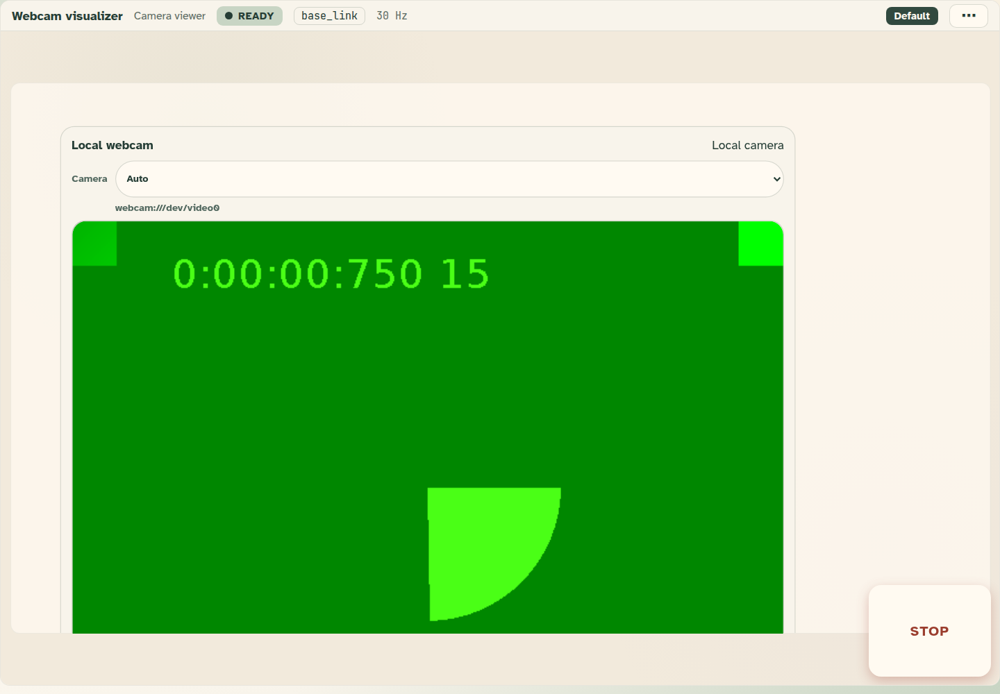

<p align="center">
  
</p>

<h1 align="center">Bloom</h1>

<p align="center">
  <strong>Build and operate accessible web interfaces for robots.</strong>
</p>

<p align="center">
  <a href="#why-bloom">Why Bloom</a> ·
  <a href="#quickstart">Quickstart</a> ·
  <a href="#extender-tutorial">Extender tutorial</a> ·
  <a href="#preview">Preview</a> ·
  <a href="#documentation">Documentation</a>
</p>

Bloom turns reusable screens and controls into operator applications, then connects them to robots through a
policy-checked backend. Build an interface visually, run that same configuration in a focused kiosk, and keep
robot-specific integration at the adapter boundary.

**Bloom is the active Extender operator interface (IHM).** `extender_ui` is legacy and remains only as a behavior
reference and emergency rollback during live acceptance.

## Why Bloom

Robot interfaces often bind screen layout, input devices, transport code, and one robot into a single application.
Bloom separates those concerns so a team can improve an operator workflow without rebuilding the command path, or add
a robot adapter without forking the interface.

Bloom provides:

- a visual **Builder** for applications, screens, widgets, themes, and runtime policies;
- a distraction-free **Runtime** with connection state, guarded maintenance access, and a backend-latched STOP;
- reusable inputs and diagnostics for touch, keyboard, gamepad, camera, plots, topics, and saved positions;
- a FastAPI boundary for storage, WebSocket sessions, policy checks, audit records, and optional ROS 2 adapters;
- ready-to-run **Explorer Manager** and **Kinova Manager** applications for Extender.

The UI model is generic. ROS 2 is one adapter, not a frontend dependency, so the same builder and runtime can support
other robots and machine gateways later.

## Quickstart

This starts Bloom without ROS or robot hardware. You need Node.js 20+, npm 10+, Python 3.10-3.12, and
[`uv`](https://docs.astral.sh/uv/).

### 1. Install

```bash
git clone https://github.com/ISIR-EXTENDER/bloom.git
cd bloom
npm install
cd backend
uv sync
cd ..
```

### 2. Run

From the repository root, start the API in one terminal:

```bash
cd backend
make run
```

Start the dashboard from the repository root in a second terminal:

```bash
npm run dev
```

### 3. Open

Visit [http://127.0.0.1:5173](http://127.0.0.1:5173). Choose **Builder** to compose an interface, or **Runtime** to
launch one of the shared applications.

The backend imports the tracked applications on first start. ROS diagnostics show `MISSING` when no ROS graph is
attached; that is expected in this quickstart and still lets you inspect the full UI safely.

## Extender Tutorial

This walkthrough connects Bloom to `cartesian_manager` and runs either Explorer in simulation or Kinova with fake
hardware. Complete the [Quickstart](#quickstart) installation first.

> [!CAUTION]
> Start with simulation or fake hardware. Bloom's STOP latches the software command path, but it does not replace the
> robot's hardware emergency stop, controller limits, or lab safety procedure. Single-switch directional teleoperation
> is still awaiting validation with the intended device; see the
> [operator runtime guide](docs/operator-runtime.md#accessibility-profiles).

### 1. Build the Extender workspace

```bash
cd /path/to/extender_workspace
source /opt/ros/jazzy/setup.bash
colcon build --symlink-install
source install/setup.bash
```

### 2. Start one robot

For **Explorer simulation**:

```bash
cd /path/to/extender_workspace
source /opt/ros/jazzy/setup.bash
source install/setup.bash
ros2 launch cartesian_manager explorer.launch.py use_simulation:=true
```

Or, for **Kinova fake hardware**:

```bash
cd /path/to/extender_workspace
source /opt/ros/jazzy/setup.bash
source install/setup.bash
ros2 launch cartesian_manager kinova.launch.py use_simulation:=true
```

Keep that terminal running.

### 3. Start Bloom for that robot

In a new terminal, start the API with ROS adapters and the dashboard together.

For **Explorer**:

```bash
cd /path/to/bloom
EXTENDER_WORKSPACE=/path/to/extender_workspace \
BLOOM_ROBOT_NAME=Explorer \
BLOOM_ROS_COMMAND_FRAME_ID=base_link \
BLOOM_ALLOWED_COMMAND_FRAME_IDS=base_link,ft_frame,hybrid_frame \
scripts/extender-workspace-dev.sh
```

For **Kinova**:

```bash
cd /path/to/bloom
EXTENDER_WORKSPACE=/path/to/extender_workspace \
BLOOM_ROBOT_NAME=Kinova \
BLOOM_ROS_COMMAND_FRAME_ID=base_link \
BLOOM_ALLOWED_COMMAND_FRAME_IDS=base_link,effector_frame,hybrid_frame \
scripts/extender-workspace-dev.sh
```

The launcher sources the selected workspace, starts the ROS-enabled API on port `8000`, and starts the dashboard on
port `5173`. `Ctrl+C` stops both Bloom processes.

### 4. Operate the Manager app

1. Open [http://127.0.0.1:5173](http://127.0.0.1:5173) and choose **Runtime**.
2. Launch **Explorer Manager** or **Kinova Manager** to match the robot process you started.
3. Before moving a control, confirm the kiosk bar shows the expected app, robot, profile, `base_link` frame, and link
   state. `READY` describes the frontend-to-backend link; use the diagnostics below to verify the ROS path.
4. Open **Joystick lab** from Maintenance for the physical-joystick-equivalent workflow: choose a supported command
   frame, then use translation, height, rotation, pivot, modes, and gripper on one screen. Frame buttons stay disabled
   until every motion control is back at zero.
5. Use **Drive** for the regular operating layout and speed limits. Hold the maintenance button for 1.5 seconds to
   reach **Positions**, **Robot feedback**, and **Command sources**.
6. Press **STOP** to latch command output. Resume only after checking the cause, using the one-second hold.

Both Manager apps share the same workflow. Explorer permits `ft_frame`; Kinova permits `effector_frame` and adds the
reviewed fault-reset action. Joystick Lab keeps every frame choice visible and explains when the connected robot does
not support one.

### 5. Verify the command path

In another sourced ROS terminal:

```bash
source /opt/ros/jazzy/setup.bash
source /path/to/extender_workspace/install/setup.bash
ros2 topic info /joystick_cartesian_command
ros2 topic echo /joystick_cartesian_command
ros2 topic echo /cartesian_command
```

Move one Drive control and release it. The manager output should become non-zero while commanded and return to zero on
release. In Joystick Lab, select a frame while the controls are at zero and confirm the next
`/joystick_cartesian_command` message carries that `header.frame_id`. Bloom follows this path:

```text
browser control -> Bloom WebSocket -> ROS adapter -> /joystick_cartesian_command
                -> cartesian_manager -> /cartesian_command
```

Check Bloom itself from another terminal:

```bash
curl -fsS http://127.0.0.1:8000/api/v1/health
curl -fsS http://127.0.0.1:8000/api/v1/ros/topics/status
```

The full pre-session checklist, including modes, gripper, gamepad, tablet, and STOP validation, is in
[Extender and Petanque end-to-end validation](docs/extender-petanque-validation.md).

<details>
<summary>Run on real hardware</summary>

Use the normal lab authorization and safety procedure first. Then replace the simulation launch with the matching
hardware command.

Explorer:

```bash
ros2 launch cartesian_manager explorer.launch.py use_simulation:=false
```

Kinova, replacing the address when needed:

```bash
ros2 launch cartesian_manager kinova.launch.py use_simulation:=false robot_ip:=192.168.1.10
```

</details>

## Preview

| Builder | Explorer Manager | Kinova Manager |
| --- | --- | --- |
|  |  |  |

<details>
<summary>More product and runtime screens</summary>

| Home | Screen library | Runtime library |
| --- | --- | --- |
|  |  |  |

| App configuration | Positions | Robot feedback |
| --- | --- | --- |
|  |  |  |

| Command sources | Camera | Bloom Debug |
| --- | --- | --- |
|  |  |  |

</details>

The captures intentionally run without ROS, so topic diagnostics read `MISSING`. Refresh every tracked image from a
running dashboard and isolated seeded backend with:

```bash
npx playwright install chromium
BLOOM_DASHBOARD_URL=http://127.0.0.1:5173 npm run capture:readme
```

The capture script exits non-zero for skipped screens or when the backend store differs from the committed shared
applications, so it cannot silently leave a stale image in this README.

## What Ships Today

- Builder and kiosk runtime for shared application, screen, widget, theme, profile, and guardrail models.
- Touch, keyboard, and gamepad Cartesian input composed into one application-scoped 6-DoF command.
- Explorer and Kinova Manager workflows for Joystick Lab, Drive, Positions, Robot feedback, and Command sources.
- JSON and SQLite configuration storage, tracked seed applications, import/export, audit, and recording hooks.
- ROS 2 integration for `cartesian_manager`, generic topic publishing, service calls, and topic discovery.
- Frontend, backend, security, contract, and visual checks in CI.

Single-switch directional teleoperation is covered by the current scan-step implementation and tests, but still needs
validation with the intended device. Browser reduced-motion preferences work; the equivalent saved profile setting
still needs wiring. Track these and the current design review in [the UX design handoff](docs/ux-design-handoff.md).

## Product Status

New Extender IHM work belongs in Bloom. The remaining work is explicit:

1. Complete the open design work around physical sizing, profile settings, supervisor handover, onboarding, and i18n.
2. Validate the Bloom IHM on the target tablets, assistive inputs, simulations, and robots.
3. Keep `extender_ui` rollback artifacts until the relevant live sessions are accepted.
4. Retain generic web/ROS boundaries so Bloom can serve robots beyond Extender.

Low-level Extender ROS packages remain active dependencies. The archived Petanque path keeps its explicit legacy
adapter until its future is decided.

## Repository Shape

```text
bloom/
  frontend/
    apps/bloom-dashboard/      # React product shell
    libs/api-client/           # Typed API client
    libs/ui/                   # Bloom design-system primitives
    libs/widgets/              # Widget contracts and settings
    libs/widget-renderers/     # Builder/runtime widget rendering
  backend/
    apps/bloom_api/            # FastAPI app
    apps/bloom_cli/            # Typer CLI
    libs/config/               # Configuration domain, JSON, SQLite
    libs/ros_adapters/         # Optional ROS 2 boundary
    libs/sessions/             # Runtime sessions, audit, recording, teleop
  docs/
```

## Shared Applications

The first time the backend starts it imports the applications committed under
`backend/seed/applications/`: Explorer Manager, Kinova Manager, Sandbox V0.0,
Explorer User Tests, Petanque Admin, Bloom Debug, and the webcam demo. A fresh clone comes up
with the same app library everyone else has.

Your own store lives in `backend/data/`, which is not tracked. Seeding never
overwrites an application you already have, so screens you rearrange in the
builder stay yours. To reset one back to the committed version, or to import
anything that is missing:

```bash
cd backend
uv run python -m apps.bloom_cli.main config seed
uv run python -m apps.bloom_cli.main config seed --force explorer-manager
```

To share an app you have built or changed, publish it and commit the file it
writes:

```bash
uv run python -m apps.bloom_cli.main config publish explorer-manager
git add ../backend/seed/applications/explorer-manager.json
```

To see what you have not shared yet:

```bash
uv run python -m apps.bloom_cli.main config status
```

It reads whichever store is configured and marks each application `shared`, `edited`, `local`, or `missing`.

## Extender Reference

The [Extender tutorial](#extender-tutorial) is the normal development path. Its launcher accepts these useful
overrides:

- `EXTENDER_WORKSPACE` or `EXTENDER_SETUP_FILE` selects the ROS workspace to source.
- `BLOOM_API_HOST` / `BLOOM_API_PORT` and `BLOOM_FRONTEND_HOST` / `BLOOM_FRONTEND_PORT` change the listening addresses.
- `BLOOM_APPLY_TABLET_TOUCH_MAP=1` applies the target tablet's touch mapping before startup.

To run only the ROS-enabled API:

```bash
source /opt/ros/jazzy/setup.bash
source /path/to/extender_workspace/install/setup.bash
cd /path/to/bloom/backend
make ros-run
```

Useful validation endpoints:

```bash
curl -fsS http://127.0.0.1:8000/api/v1/health
curl -fsS http://127.0.0.1:8000/api/v1/ros/topics
curl -fsS http://127.0.0.1:8000/api/v1/runtime/audit
```

The full Extender/Petanque validation protocol is in
[docs/extender-petanque-validation.md](docs/extender-petanque-validation.md).
The kiosk, controls, profiles, gamepad, and command-frame contract is in the
[operator runtime guide](docs/operator-runtime.md). Deployment settings and tablet startup are in the
[Extender workspace deployment guide](docs/extender-workspace-deployment.md).

Useful contract checks:

```bash
npm run validation:extender
npm run validation:frontend-backend
npm run validation:sandbox-runtime
npm run validation:sandbox-tablet
npm run validation:visual-servoing
npm run validation:petanque-parity
```

## Architecture

Core rules:

- Generic frontend/backend code must not import ROS directly.
- ROS-specific code belongs in `backend/libs/ros_adapters`.
- Widgets describe intent and settings; adapters decide how those intents reach a robot or machine.
- Runtime safety is enforced in the backend through allowlists, rate limits, validation, and audit logs.
- The builder and runtime must render the same screen model; runtime only removes editor affordances.
- App-specific visual identity belongs in app theme tokens, not hard-coded widget styles.

This keeps Bloom reusable for Extender, Petanque, non-ROS lab machines, and future supervision apps.

## Configuration Storage

Bloom supports file-backed JSON and SQLite:

```bash
cd backend
uv run python -m apps.bloom_cli.main config list --storage file
uv run python -m apps.bloom_cli.main config list --storage sqlite --database-path data/bloom.db
```

SQLite is the default store, at `backend/data/bloom.db`. It keeps the full configuration bundle plus normalized rows
for applications, screens, widgets, and theme assets. A machine that still has a file-backed
`backend/data/configurations/` is carried across into it the first time the API starts, so nothing is left behind.

File storage remains available with `BLOOM_CONFIGURATION_STORAGE=file`, and JSON stays the interchange format: the
shared bundles, `config import` / `config export`, and `config publish` all speak it whichever store is configured.
The app/screen API save-load flow and its differences from `extender_ui` are documented in
[docs/runtime-flow-vs-extender-ui.md](docs/runtime-flow-vs-extender-ui.md).

Legacy JSON helpers:

```bash
uv run python -m apps.bloom_cli.main config import-legacy-screen legacy-sandbox tests/fixtures/legacy/sandbox_control.json
uv run python -m apps.bloom_cli.main config import-legacy-application play-petanque tests/fixtures/legacy/application-play-petanque.json
```

## Security Defaults

Local development keeps authentication disabled. Shared lab, staging, and production-style runs should enable API keys
and explicit CORS origins:

```bash
export BLOOM_AUTH_ENABLED=true
export BLOOM_ADMIN_API_KEY='replace-with-admin-secret'
export BLOOM_OPERATOR_API_KEY='replace-with-operator-secret'
export BLOOM_CORS_ALLOWED_ORIGINS='http://tablet.local:5173,http://dashboard.local:5173'
```

### ROS Command Backend

```bash
# cartesian_manager (default) or teleop_command for the legacy rollback path
export BLOOM_ROS_COMMAND_BACKEND=cartesian_manager
# A frame the manager knows: base_link, ft_frame/effector_frame, or hybrid_frame
export BLOOM_ROS_COMMAND_FRAME_ID=base_link
```

Since `cartesian_manager` PR #6, `frame_id` selects the frame the rotation part
is interpreted in: `base_link` is summed directly, `ft_frame` or
`effector_frame` is rotated into base with the live pose, and `hybrid_frame`
uses the manager's hybrid pose. The linear component follows the manager's base
convention. An unknown frame is rejected by Bloom when outside its deployment
allowlist and skipped by the manager if it reaches it. There is no general TF
lookup.

The deployment value is the fallback. In **Builder -> App configuration ->
Adapter guardrails**, set **Cartesian command frame** as the runtime-session
default. Joystick Lab may switch to another supported frame while the composed
twist is zero. Every virtual control and physical gamepad contribution still
shares the one effective session frame shown in the kiosk bar.

Use `X-Bloom-API-Key` for API calls. Admin keys can mutate configuration; operator keys can read configuration and use
runtime/ROS endpoints. Production settings intentionally fail to start without authentication and an admin key.

Security docs:

- [docs/security-baseline.md](docs/security-baseline.md)
- [SECURITY.md](SECURITY.md)

## Testing

Run the main checks before opening PRs:

```bash
npm run check
npm run test
npm run build
cd backend
make test
```

Additional checks:

```bash
npm run validation:extender
npm run validation:sandbox-tablet
npm run validation:sandbox-runtime
npm run validation:visual-servoing
npm run visual:smoke
npm run audit:security
npm run security:dynamic
```

Backend tests intentionally disable external pytest plugin autoloading so a sourced ROS environment cannot leak
ROS-specific pytest plugins into generic Bloom tests.

## Tooling

| Tool | Recommended | Used for |
| --- | --- | --- |
| Node.js | `>=20` | Frontend workspaces, Vite, React, TypeScript tests. |
| npm | `>=10` | Workspace dependencies and frontend scripts. |
| uv | latest stable | Backend dependency locking, tests, and CLI commands. |
| GitHub CLI | latest stable | PR creation, CI checks, and squash-merge workflow. |
| Playwright | installed through npm | Browser checks and README screenshots. |

Local frontend work supports Node.js 20+, while GitHub CI currently runs Node.js 24 to match hosted runner baselines.

## Documentation

High-signal project docs:

- [docs/README.md](docs/README.md)
- [docs/operator-runtime.md](docs/operator-runtime.md)
- [docs/design-system.md](docs/design-system.md)
- [docs/component-styleguide.md](docs/component-styleguide.md)
- [docs/widget-ux-review.md](docs/widget-ux-review.md)
- [docs/production-readiness-review.md](docs/production-readiness-review.md)
- [docs/accessibility-plan.md](docs/accessibility-plan.md)
- [docs/ux-design-handoff.md](docs/ux-design-handoff.md)
- [docs/extender-tablet-hardware.md](docs/extender-tablet-hardware.md)
- [docs/extender-workspace-deployment.md](docs/extender-workspace-deployment.md)
- [docs/extender-petanque-validation.md](docs/extender-petanque-validation.md)
- [docs/legacy-retirement-gates.md](docs/legacy-retirement-gates.md)

Design decisions and migration notes live in [docs/decisions](docs/decisions). Add a new decision when an architectural,
UX, security, or adapter choice would be hard to infer from code alone.

## License

MIT. See [LICENSE](LICENSE).
