<p align="center">
  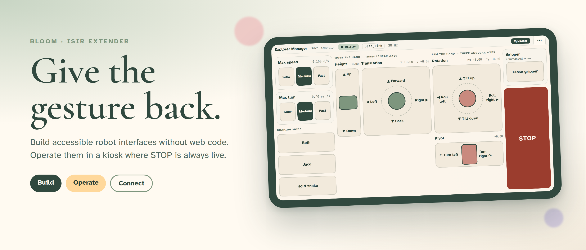
</p>

<p align="center">
  <a href="https://github.com/ISIR-EXTENDER/bloom/actions/workflows/ci.yml"></a>
  
  
  
  
</p>

<p align="center">
  <a href="#why-bloom">Why Bloom</a> ·
  <a href="#watch-it-run">Watch it run</a> ·
  <a href="#quickstart">Quickstart</a> ·
  <a href="#tutorials">Tutorials</a> ·
  <a href="#preview">Preview</a> ·
  <a href="#design-language">Design language</a> ·
  <a href="#documentation">Documentation</a>
</p>

Bloom builds accessible web interfaces for robots and runs them in a focused kiosk. Compose screens visually, open the
saved app as a role on a tablet or desktop, and reach the robot through a policy-checked backend that keeps ROS at the
adapter boundary.

**Bloom is the active Extender operator interface (IHM).** `extender_ui` is legacy and remains only as a behaviour
reference and emergency rollback during live acceptance.

## Why Bloom

Extender's older interfaces coupled screen layout, input devices, ROS transport, and one robot. Bloom replaces that
pattern with one configurable interface system:

- **Build** reusable robot screens, controls, themes, profiles, and safety policies in the visual Builder.
- **Operate** the saved application in a focused Runtime with one explicit control owner, guarded maintenance,
  diagnostics, and a latched STOP.
- **Connect** it through FastAPI and WebSockets to ROS 2 or another machine adapter without putting transport code in
  the frontend.

Explorer Manager and Kinova Manager ship ready to run. The same model also provides accessible input profiles, a
read-only Supervisor mirror, plots, topic inspection, audit records, and shared JSON/SQLite configuration.

## Watch It Run

<p align="center">
  <a href="docs/assets/demo/bloom-demo.mp4">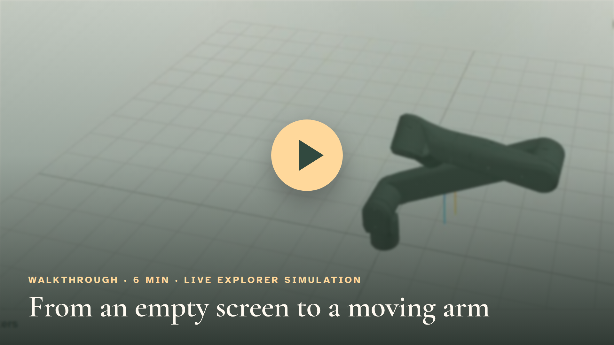</a>
</p>

**[Watch the five-minute walkthrough](docs/assets/demo/bloom-demo.mp4).** It creates an app and a screen in the
Builder, opens Explorer Manager as Operator, drives the arm, sends it home, switches frames in Joystick Lab, changes
Settings to Spanish, latches and resumes STOP, and reads live joint states and the Jacobian in Bloom Debug. Nothing is
mocked: it runs against `cartesian_manager`, `qontrol_controller` and the Explorer Gazebo simulation. The camera scene
uses a synthetic feed.

## Quickstart

This starts Bloom without ROS or robot hardware. You need Node.js 24 LTS, npm 11+, Python 3.10-3.12, and
[`uv`](https://docs.astral.sh/uv/).

### 1. Install

```bash
git clone https://github.com/ISIR-EXTENDER/bloom.git
cd bloom
npm install
cd backend
uv sync
cd ..
```

### 2. Run

From the repository root, start the API in one terminal:

```bash
cd backend
make run
```

Start the dashboard from the repository root in a second terminal:

```bash
npm run dev
```

### 3. Open

Visit [http://127.0.0.1:5173](http://127.0.0.1:5173). Choose **Builder** to compose an interface, or **Runtime** to
launch one of the shared applications.

The backend imports the tracked applications on first start. ROS diagnostics show `MISSING` when no ROS graph is
attached; that is expected in this quickstart and still lets you inspect the full UI safely.

To go from here to a moving arm, follow [Getting started](docs/tutorials/getting-started.md).

## Tutorials

Three walkthroughs in [`docs/tutorials/`](docs/tutorials/), in the order a newcomer needs them:

- **[Getting started](docs/tutorials/getting-started.md)** — from this clone to a simulated Explorer or Kinova arm
  moving under your hand, with the ROS commands that prove it.
- **[Build your first app](docs/tutorials/build-your-first-app.md)** — create an app, add a screen, place a joystick
  and a command button, point it at a topic, pass the review checklist, open it as a role.
- **[Operate safely](docs/tutorials/operate-safely.md)** — the operator's page: roles, the kiosk bar, STOP and resume,
  maintenance, settings, and what to check before touching a control.

> [!CAUTION]
> Start with simulation or fake hardware. Bloom's STOP latches the software command path, but it does not replace the
> robot's hardware emergency stop, controller limits, or lab safety procedure. Single-switch directional teleoperation
> and combined scan-plus-dwell are still awaiting validation with the intended devices; see the
> [operator runtime guide](docs/operator-runtime.md#accessibility-profiles).

To open Bloom from a phone or tablet on the same trusted network, keep the API on loopback and expose only Vite:

```bash
BLOOM_FRONTEND_HOST=0.0.0.0 \
BLOOM_PUBLIC_HOST="$(hostname -I | awk '{print $1}')" \
scripts/extender-workspace-dev.sh
```

The launcher prints `Same-Wi-Fi URL: http://<lan-ip>:5173`. Every connected device reads and writes the same
server-side `backend/data/bloom.db`, so a Builder save is visible after another device reloads. Do not port-forward
this development server. The [deployment guide](docs/deployment.md#same-wi-fi-access) covers verification, custom
ports, firewall rules and database operations.

## Preview

| Builder | Explorer Manager | Kinova Manager |
| --- | --- | --- |
| 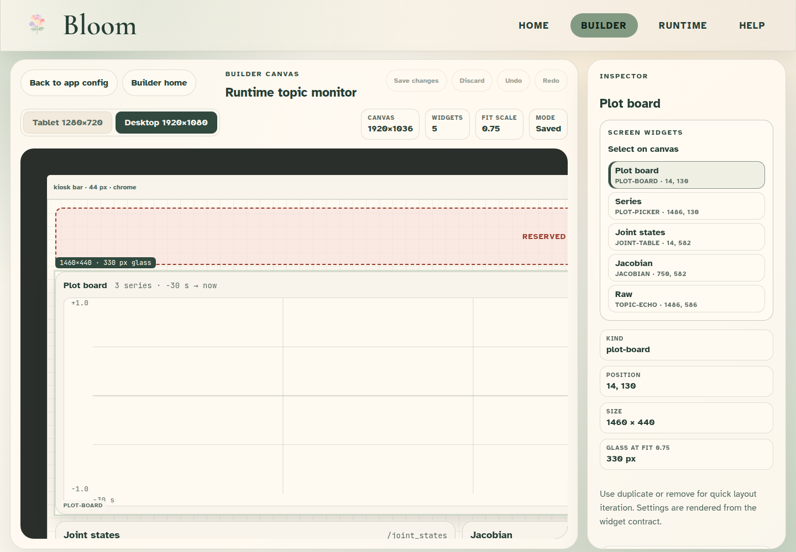 | 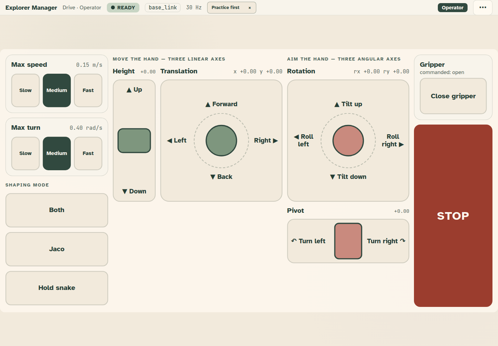 | 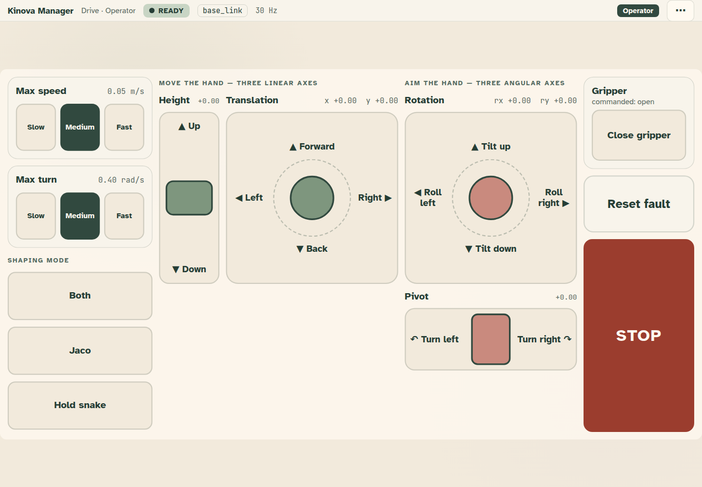 |

<details>
<summary>More product and runtime screens</summary>

| Home | Screen library | Runtime library |
| --- | --- | --- |
| 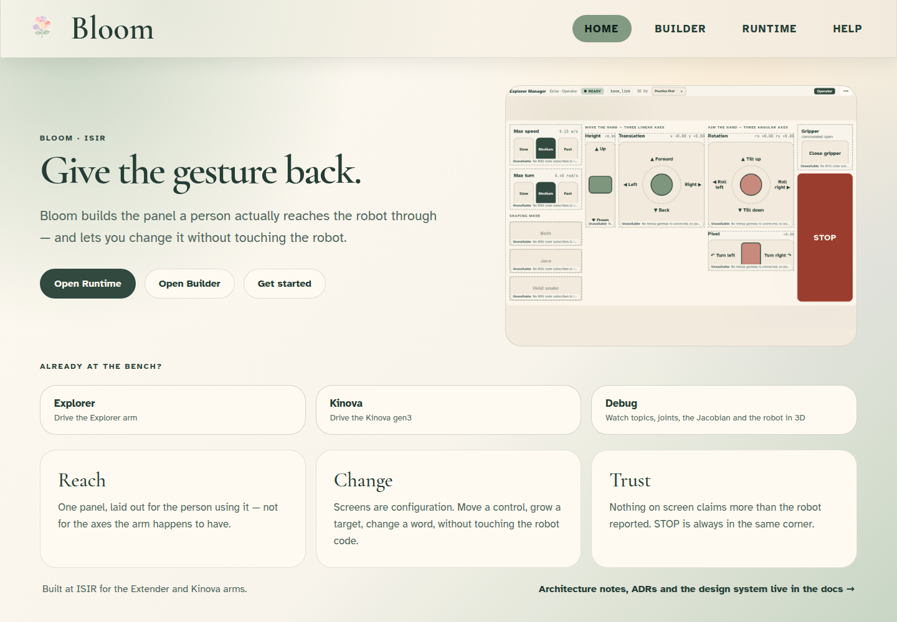 | 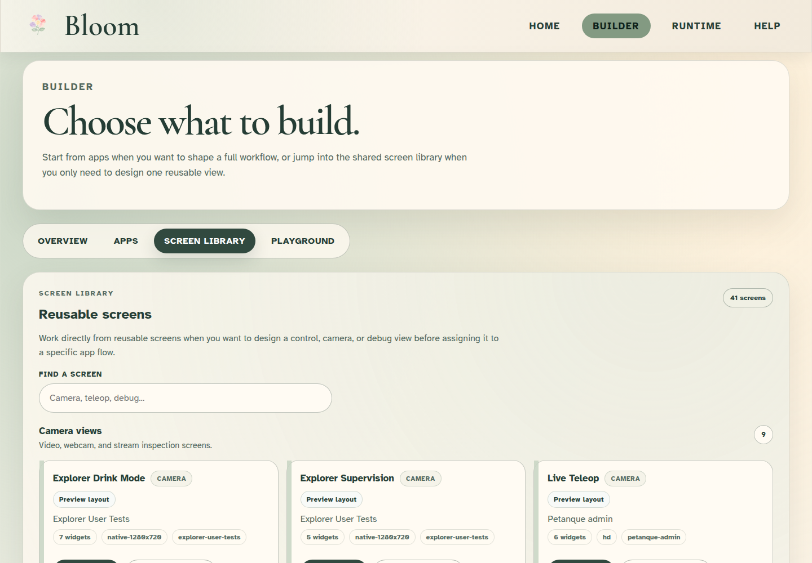 | 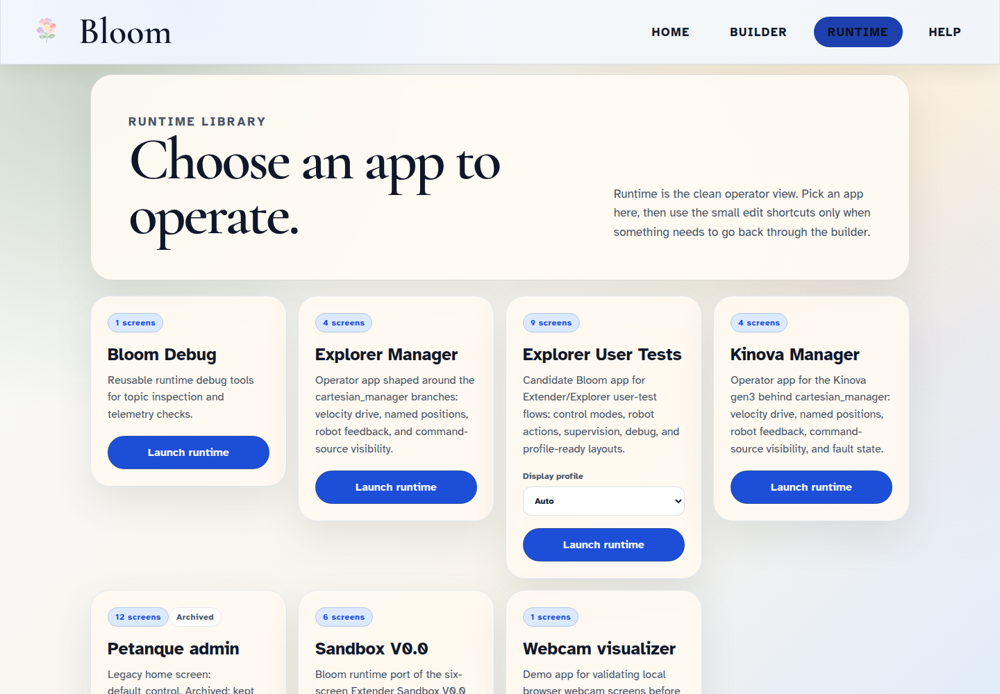 |

| App configuration | Positions | Robot feedback |
| --- | --- | --- |
| 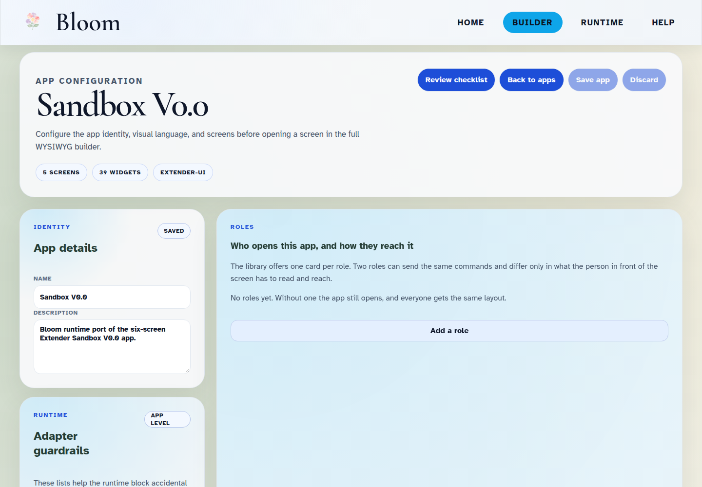 | 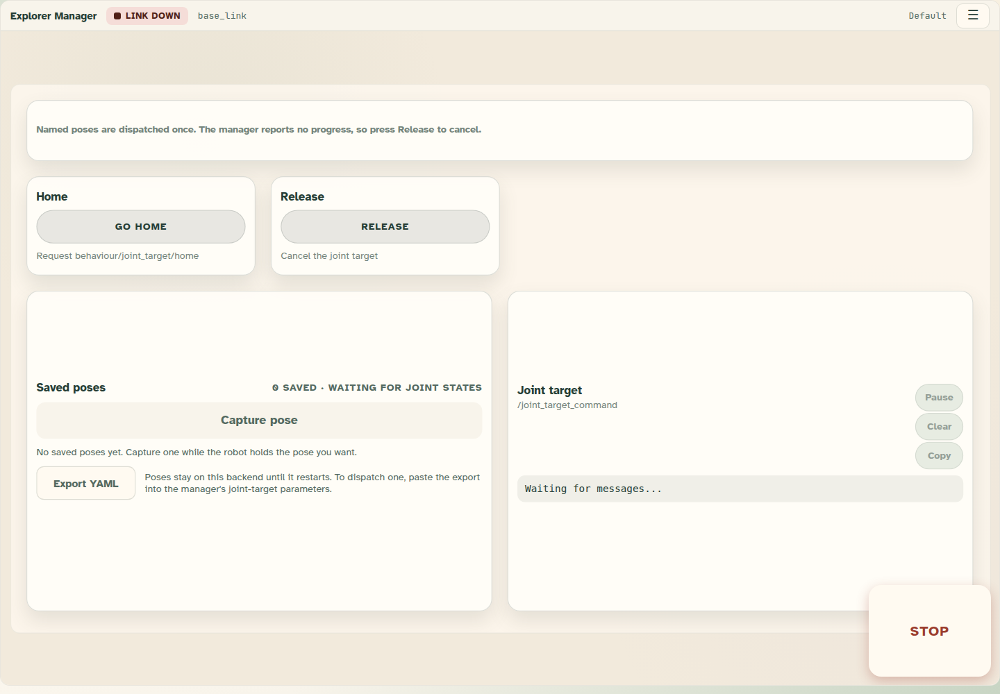 | 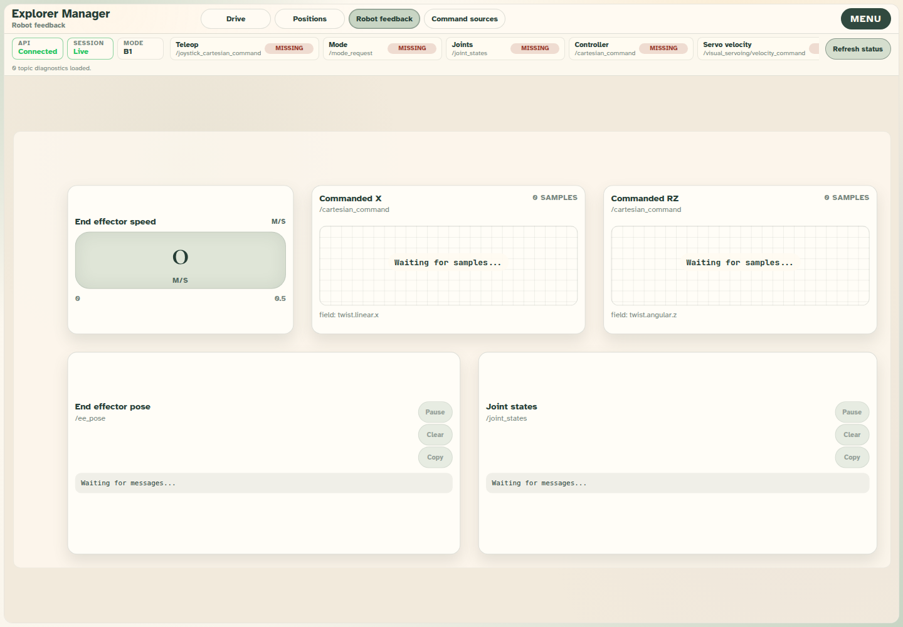 |

| Joystick Lab | Command sources | Bloom Debug |
| --- | --- | --- |
| 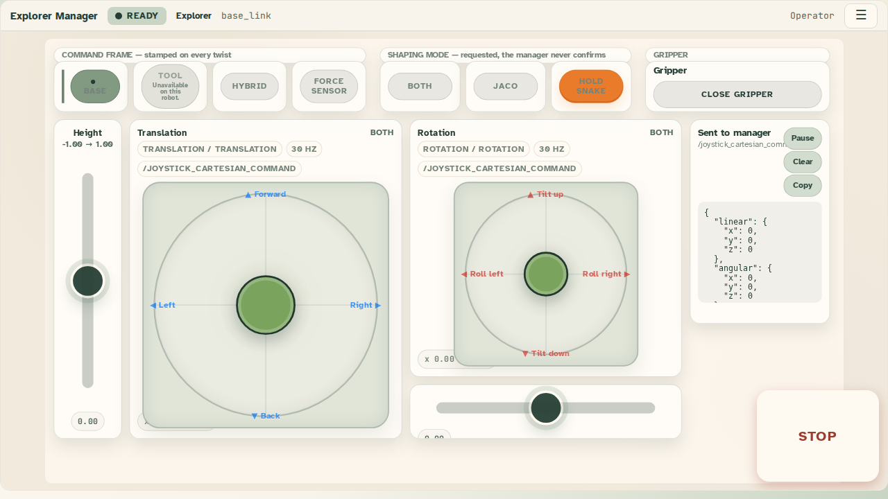 | 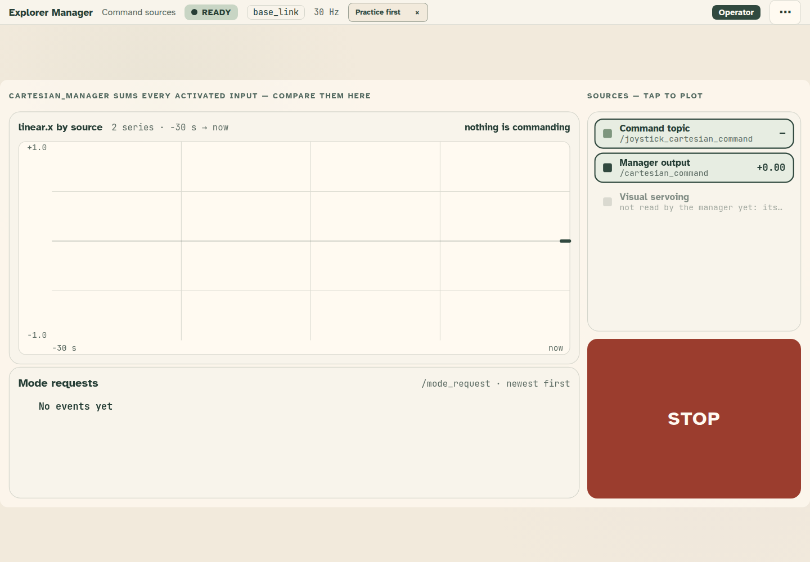 | 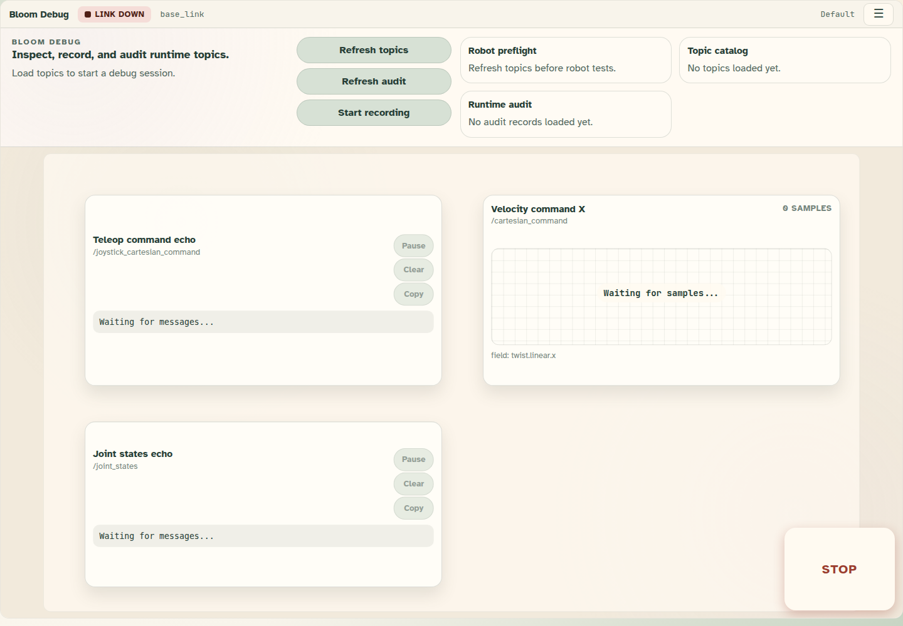 |

</details>

The general preview set is captured from the ROS bench, so a control whose topic has no subscriber there reads as
unavailable. The Joystick Lab image and the walkthrough use a live ROS graph. Refresh the general set from a running dashboard and
isolated seeded backend with:

```bash
npx playwright install chromium
BLOOM_DASHBOARD_URL=http://127.0.0.1:5173 npm run capture:readme
```

The capture script exits non-zero for skipped screens or when the backend store differs from the committed shared
applications, so it cannot silently leave a stale image in this README.

Record the walkthrough from a seeded ROS-enabled runtime, with a visible cursor and captions. `--probe <dir>` runs it
quickly and saves one screenshot per scene instead:

```bash
BLOOM_DASHBOARD_URL=http://127.0.0.1:5173 \
BLOOM_DEMO_ROS_SETUP=/path/to/extender_workspace/install/setup.bash \
npm run record:demo -- --camera feed.y4m
```

The recorder uses Playwright and `ffmpeg`; install Chromium with the command above and provide `ffmpeg` on `PATH`.

## What Ships Today

- Builder and kiosk runtime for shared application, screen, widget, theme, profile, and guardrail models.
- Touch, keyboard, and gamepad Cartesian input composed into one application-scoped 6-DoF command.
- Per-profile English, Spanish, and French runtime shells with an English fallback.
- Local-only guided operator practice and an action-based Builder review checklist.
- A read-only supervisor mirror with an explicit operator-ownership notice and no command client surface.
- Explorer and Kinova Manager workflows for Joystick Lab, Drive, Positions, Robot feedback, and Command sources.
- JSON and SQLite configuration storage, tracked seed applications, import/export, audit, and recording hooks.
- ROS 2 integration for `cartesian_manager`, generic topic publishing, service calls, and topic discovery.
- One 30 Hz latest-value teleop stream across every active control, with neutral commands sent immediately.
- Frontend, backend, security, contract, and visual checks in CI, plus an end-to-end run against the Explorer and
  Kinova simulations that checks each effect on the ROS graph.
- Role-based layouts: a profile names the screen it opens, and Drive ships as Bench and Operator.
- Widget cards built to the design system: minimum sizes that grow rather than clip, reserved regions for STOP,
  multi-series plot boards and pickers, a joint table, and a Jacobian with manipulability.

Single-switch directional teleoperation is covered by the current scan-step implementation and tests, but still needs
validation with the intended device. Browser reduced-motion preferences work; the equivalent saved profile setting
still needs wiring. Track these and the current design review in [the UX design handoff](docs/ux-design-handoff.md).

## Product Status

New Extender IHM work belongs in Bloom. The remaining work is explicit:

1. Complete the open design work: the 1024×600 collapse layouts, paired desktop apps, the save-a-pose flow, and
   deliberate handover only if supervisors are later allowed to command.
2. Validate the Bloom IHM on the target tablets, assistive inputs and robots. The simulations are covered by
   `npm run e2e:sim`, and visual servoing has been driven from Bloom on the new architecture.
3. Keep `extender_ui` rollback artifacts until the relevant live sessions are accepted.
4. Retain generic web/ROS boundaries so Bloom can serve robots beyond Extender.

Low-level Extender ROS packages remain active dependencies. The archived Petanque path keeps its explicit legacy
adapter until its future is decided.

## Design Language

<p align="center">
  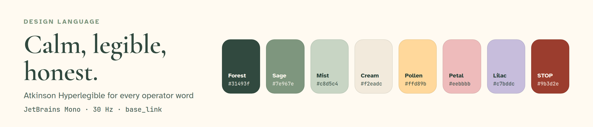
</p>

Bloom's interface is calm on purpose. Operator words use Atkinson Hyperlegible, readouts and topics a monospace face,
and colour carries meaning rather than decoration: forest for what is selected, pollen for what is held, lilac only in
Bloom Debug, and the STOP red nowhere else. Every widget declares a minimum size and grows rather than clips, and STOP
lives in a reserved region widgets cannot enter. The tokens, prototypes and screen specs are tracked in
[docs/design](docs/design); the artwork on this page is rendered from those tokens with
`node scripts/render-readme-art.mjs`.

## Repository Shape

```text
bloom/
  frontend/
    apps/bloom-dashboard/      # React product shell
    libs/api-client/           # Typed API client
    libs/ui/                   # Bloom design-system primitives
    libs/widgets/              # Widget contracts and settings
    libs/widget-renderers/     # Builder/runtime widget rendering
  backend/
    apps/bloom_api/            # FastAPI app
    apps/bloom_cli/            # Typer CLI
    libs/config/               # Configuration domain, JSON, SQLite
    libs/ros_adapters/         # Optional ROS 2 boundary
    libs/sessions/             # Runtime sessions, audit, recording, teleop
  docs/
```

## Shared Applications

Every time the backend starts it imports the applications committed under
`backend/seed/applications/` that the store is missing: Explorer Manager, Kinova Manager, Sandbox V0.0,
Petanque admin, Bloom Debug, and the webcam visualizer. A fresh clone comes up
with the same app library everyone else has.

Your own store lives in `backend/data/`, which is not tracked. Seeding never
overwrites an application you have edited, so screens you rearrange in the
builder stay yours; a copy nobody edited takes the shipped version, and an app
someone deleted on purpose stays deleted. To reset one back to the committed
version, or to import anything that is missing:

```bash
cd backend
uv run python -m apps.bloom_cli.main config seed
uv run python -m apps.bloom_cli.main config seed --force explorer-manager
```

To share an app you have built or changed, publish it and commit the file it
writes:

```bash
uv run python -m apps.bloom_cli.main config publish explorer-manager
git add ../backend/seed/applications/explorer-manager.json
```

To see what you have not shared yet:

```bash
uv run python -m apps.bloom_cli.main config status
```

It reads whichever store is configured and marks each application `shared`, `outdated`, `edited`, `local`, `missing`,
or `deleted`. The [operator guide](docs/operator-runtime.md#shared-applications-and-local-state) says what each means.

## Extender Reference

[Getting started](docs/tutorials/getting-started.md) is the normal development path. Its launcher accepts these
useful overrides:

- `EXTENDER_WORKSPACE` or `EXTENDER_SETUP_FILE` selects the ROS workspace to source. The default is an
  `extender_workspace` checkout next to this repository.
- `BLOOM_API_HOST` / `BLOOM_API_PORT` and `BLOOM_FRONTEND_HOST` / `BLOOM_FRONTEND_PORT` change the listening addresses.
- `BLOOM_API_PROXY_TARGET` overrides Vite's server-side API target; the launcher derives it from `BLOOM_API_PORT` by
  default.
- `BLOOM_PUBLIC_HOST` controls the same-Wi-Fi URL printed for wildcard frontend binds.
- `BLOOM_APPLY_TABLET_TOUCH_MAP=1` applies the target tablet's touch mapping before startup.

To run only the ROS-enabled API:

```bash
source /opt/ros/jazzy/setup.bash
source /path/to/extender_workspace/install/setup.bash
cd /path/to/bloom/backend
make ros-run
```

Useful validation endpoints:

```bash
curl -fsS http://127.0.0.1:8000/api/v1/health
curl -fsS http://127.0.0.1:8000/api/v1/ros/topics
curl -fsS http://127.0.0.1:8000/api/v1/runtime/audit
```

The full Extender/Petanque validation protocol is in
[docs/extender-petanque-validation.md](docs/extender-petanque-validation.md).
The kiosk, controls, profiles, gamepad, and command-frame contract is in the
[operator runtime guide](docs/operator-runtime.md). Deployment settings and tablet startup are in the
[Extender workspace deployment guide](docs/deployment.md).

Bloom changes a mode or toggle only after the runtime acknowledges the command. **Not sent** means the configured
gateway simulated the request; **Command failed** means it was blocked, unsupported, or failed. In both cases the
control keeps its previous state, so never read a visual toggle change as proof of robot motion.

Useful contract checks:

```bash
npm run validation:extender
npm run validation:frontend-backend
npm run validation:sandbox-runtime
npm run validation:sandbox-tablet
npm run validation:visual-servoing
npm run validation:petanque-parity
```

## Architecture

Core rules:

- Generic frontend/backend code must not import ROS directly.
- ROS-specific code belongs in `backend/libs/ros_adapters`.
- Widgets describe intent and settings; adapters decide how those intents reach a robot or machine.
- Runtime safety is enforced in the backend through allowlists, rate limits, validation, and audit logs.
- One backend runtime session owns robot commands at a time; STOP remains available to every authenticated operator.
- The builder and runtime must render the same screen model; runtime only removes editor affordances.
- App-specific visual identity belongs in app theme tokens, not hard-coded widget styles.

This keeps Bloom reusable for Extender, Petanque, non-ROS lab machines, and future supervision apps.

## Configuration Storage

Bloom supports file-backed JSON and SQLite:

```bash
cd backend
uv run python -m apps.bloom_cli.main config list --storage file
uv run python -m apps.bloom_cli.main config list --storage sqlite --database-path data/bloom.db
```

SQLite is the default store, at `backend/data/bloom.db`. It keeps the full configuration bundle plus normalized rows
for applications, screens, widgets, and theme assets. A machine that still has a file-backed
`backend/data/configurations/` is carried across into it the first time the API starts, so nothing is left behind.

File storage remains available with `BLOOM_CONFIGURATION_STORAGE=file`, and JSON stays the interchange format: the
shared bundles, `config import` / `config export`, and `config publish` all speak it whichever store is configured.
The app/screen API save-load flow and the runtime action path are documented in
[docs/architecture.md](docs/architecture.md).

Legacy JSON helpers:

```bash
uv run python -m apps.bloom_cli.main config import-legacy-screen legacy-sandbox tests/fixtures/legacy/sandbox_control.json
uv run python -m apps.bloom_cli.main config import-legacy-application play-petanque tests/fixtures/legacy/application-play-petanque.json
```

## Security Defaults

Local development keeps authentication disabled. Shared lab, staging, and production-style runs should enable API keys
and explicit CORS origins:

```bash
export BLOOM_AUTH_ENABLED=true
export BLOOM_ADMIN_API_KEY='replace-with-admin-secret'
export BLOOM_OPERATOR_API_KEY='replace-with-operator-secret'
# Read-only: a supervisor mirror that cannot command the arm.
export BLOOM_OBSERVER_API_KEY='replace-with-observer-secret'
export BLOOM_CORS_ALLOWED_ORIGINS='http://tablet.local:5173,http://dashboard.local:5173'
export BLOOM_RUNTIME_CONTROL_REQUIRED=true
```

### ROS Command Backend

```bash
# cartesian_manager (default) or teleop_command for the legacy rollback path
export BLOOM_ROS_COMMAND_BACKEND=cartesian_manager
# A frame the manager knows: base_link, ft_frame/effector_frame, or hybrid_frame
export BLOOM_ROS_COMMAND_FRAME_ID=base_link
```

Since `cartesian_manager` PR #6, `frame_id` selects the frame the rotation part
is interpreted in: `base_link` is summed directly, `ft_frame` or
`effector_frame` is rotated into base with the live pose, and `hybrid_frame`
uses the manager's hybrid pose. The linear component follows the manager's base
convention. An unknown frame is rejected by Bloom when outside its deployment
allowlist and skipped by the manager if it reaches it. There is no general TF
lookup.

The deployment value is the fallback. In **Builder -> App configuration ->
Adapter guardrails**, set **Cartesian command frame** as the runtime-session
default. Joystick Lab may switch to another supported frame while the composed
twist is zero. Every virtual control and physical gamepad contribution still
shares the one effective session frame shown in the kiosk bar.

Use `X-Bloom-API-Key` for API calls. Admin keys can mutate configuration; operator keys can read configuration and use
runtime/ROS endpoints. Robot-facing HTTP calls also carry the browser's opaque `X-Bloom-Runtime-Session` lease. Bloom
sets that header itself; it is not an operator credential. Production settings intentionally fail to start without
authentication, an admin key, and runtime ownership enforcement.

Security docs:

- [docs/security-baseline.md](docs/security-baseline.md)
- [SECURITY.md](SECURITY.md)

## Testing

Run everything CI runs, in CI's order, before pushing:

```bash
npm run verify
```

It lints and tests the backend, then lints, builds and tests the frontend, audits dependencies, and runs the visual
gate. It warns when the working tree is dirty, because a push only carries what is committed. The individual steps are:

```bash
npm run check          # Biome lint and format
npm run build
npm run test
npm run visual:smoke
cd backend
make lint              # ruff lint and format check; `make format` applies formatting
make test
```

Additional checks:

```bash
npm run validation:extender
npm run e2e:sim -- --robot explorer   # or kinova: Bloom against the ROS simulation, no mocks
npm run validation:sandbox-tablet
npm run validation:sandbox-runtime
npm run validation:visual-servoing
npm run visual:smoke
npm run audit:security
npm run security:dynamic
```

Backend tests intentionally disable external pytest plugin autoloading so a sourced ROS environment cannot leak
ROS-specific pytest plugins into generic Bloom tests.

CI runs the backend on Python 3.10 and 3.12, the supported floor and the deployed version. Dependabot opens weekly pull
requests for npm, uv and GitHub Actions, grouping minor and patch updates; majors arrive one at a time.

## Tooling

| Tool | Recommended | Used for |
| --- | --- | --- |
| Node.js | `24` LTS, pinned in `.nvmrc` | Frontend workspaces, Vite, React, TypeScript tests. |
| npm | `>=11` | Workspace dependencies and frontend scripts. Ships with Node 24. |
| uv | latest stable | Backend dependency locking, tests, and CLI commands. |
| GitHub CLI | latest stable | PR creation, CI checks, and squash-merge workflow. |
| Playwright | installed through npm | Browser checks and README screenshots. |

Local work and CI both run Node.js 24, the current LTS line, read from `.nvmrc`; `npm run verify` refuses a Node
older than the `engines.node` floor in `package.json`, patch release included. On Ubuntu with the NodeSource repository, upgrade with:

```bash
sudo sed -i 's|node_[0-9]*\.x|node_24.x|' /etc/apt/sources.list.d/nodesource.list
sudo apt update
sudo apt install -y nodejs
node --version   # v24.x
```

Node 26 becomes LTS on 28 October 2026; move `.nvmrc` then.

## Documentation

[docs/README.md](docs/README.md) indexes everything and says what each page is for. The three tutorials are in
[docs/tutorials/](docs/tutorials/). The pages behind them:

- [docs/operator-runtime.md](docs/operator-runtime.md) — the canonical runtime contract.
- [docs/architecture.md](docs/architecture.md) — code boundaries, save/load and the runtime action path.
- [docs/design-system.md](docs/design-system.md) and [docs/design](docs/design) — tokens, geometry contract, screen specs.
- [docs/deployment.md](docs/deployment.md) — environment variables, same-Wi-Fi access, the lab tablet.
- [docs/security-baseline.md](docs/security-baseline.md) and [docs/accessibility-plan.md](docs/accessibility-plan.md).
- [docs/extender-petanque-validation.md](docs/extender-petanque-validation.md) and
  [docs/validation/ros-sim-e2e.md](docs/validation/ros-sim-e2e.md) — what has been proven, and how.
- [docs/ux-design-handoff.md](docs/ux-design-handoff.md) and
  [docs/legacy-retirement-gates.md](docs/legacy-retirement-gates.md) — what is still open.

Design decisions live in [docs/decisions](docs/decisions). Add one when an architectural, UX, security, or adapter
choice would be hard to infer from code alone. Closed reviews and finished plans move to
[docs/archive](docs/archive/README.md) rather than being deleted.

## License

MIT. See [LICENSE](LICENSE).
