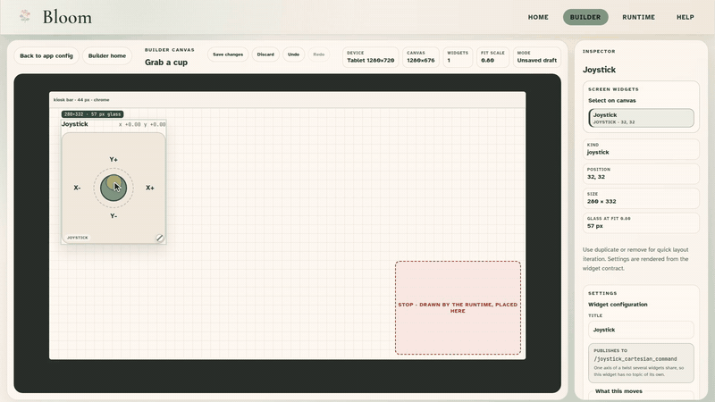
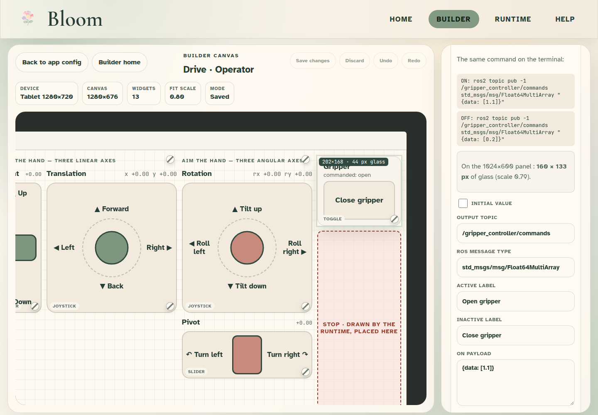
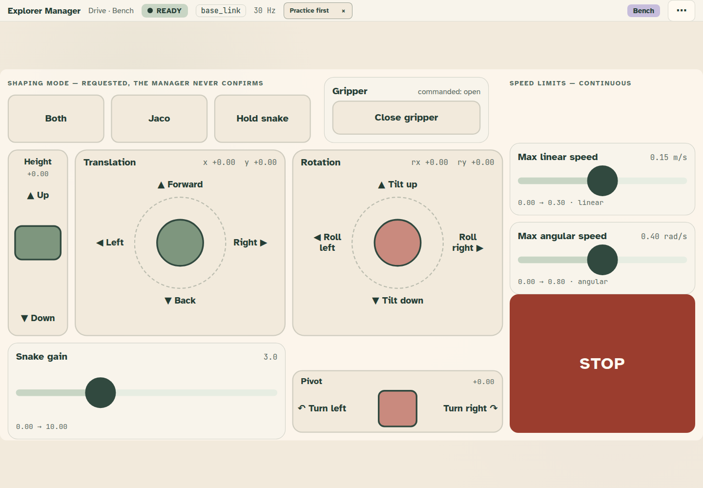
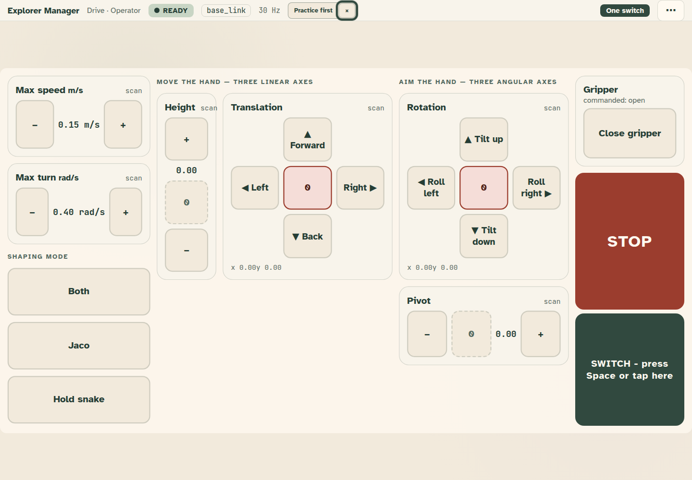
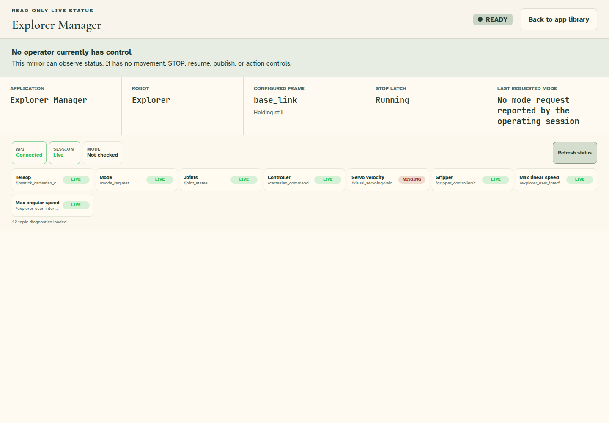
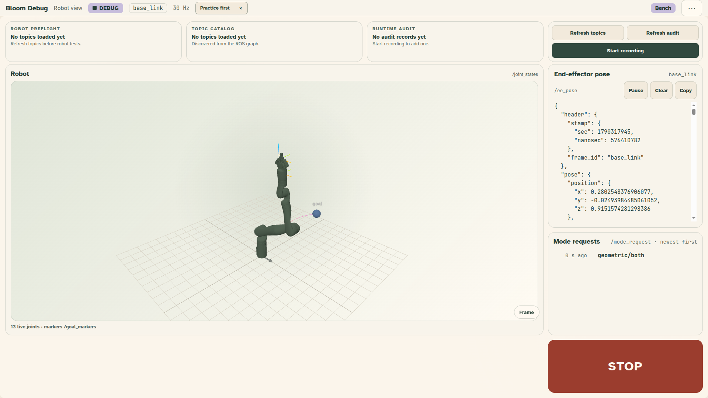
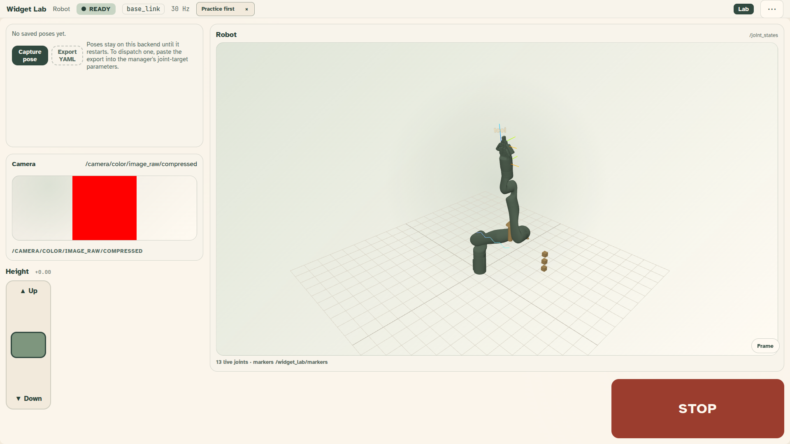
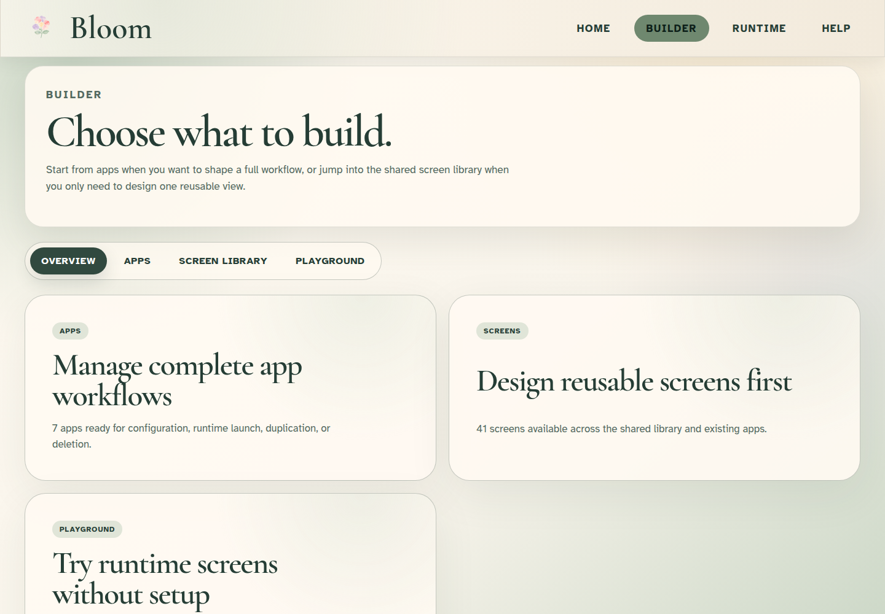
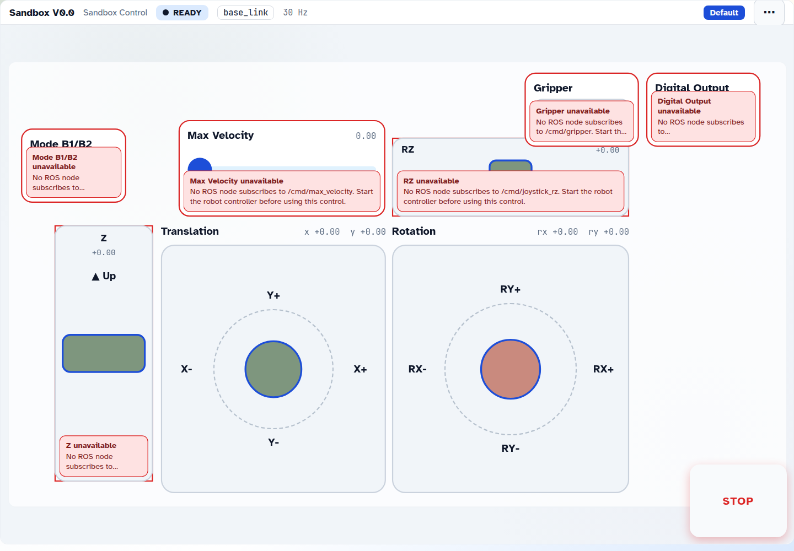

<p align="center">
  <picture>
    <source media="(prefers-color-scheme: dark)" srcset="docs/assets/readme/logo-dark.png" />
    
  </picture>
</p>

<h3 align="center">Give the gesture back.</h3>

<p align="center">
  <a href="https://github.com/ISIR-EXTENDER/bloom/actions/workflows/ci.yml"></a>
  
  
  
  
</p>

<p align="center">
  <a href="docs/assets/demo/bloom-demo.mp4">Watch it</a> ·
  <a href="#why-bloom">Why Bloom</a> ·
  <a href="#build-a-screen-without-code">Builder</a> ·
  <a href="#one-app-the-right-screen-for-each-person">Roles</a> ·
  <a href="#on-every-device">Devices</a> ·
  <a href="#see-the-robot-not-just-the-controls">3D view</a> ·
  <a href="#apps-you-can-open-today">Apps</a> ·
  <a href="#quickstart">Quickstart</a> ·
  <a href="#documentation">Documentation</a>
</p>

Bloom is the control screen for an assistive robot arm.

When someone cannot use their own arms, a robot arm, often mounted on their wheelchair, can reach, grip and bring
things to them. What that person needs is a way to tell the arm where to go that suits how they move: a finger on a
tablet, a gamepad, or one large button. Bloom is that way.

The team around them builds the screen by dragging joysticks, buttons and sliders onto a page, with no code to
write. The person opens it on a tablet and drives the arm. A large STOP is always on screen, only one screen can
command the robot at a time, and the arm only does what the lab has allowed.

<p align="center">
  <a href="docs/assets/demo/bloom-demo.mp4"></a>
</p>

<p align="center">
  <b><a href="docs/assets/demo/bloom-demo.mp4">Watch the six-minute walkthrough</a></b>: build a screen with no code,
  open it as a role, drive the Explorer arm in simulation, press STOP, and watch the arm move in 3D.
</p>

## Why Bloom

- **No code to build a screen.** Drag a joystick onto a page, choose what it moves, save. Every screen in this
  repository was made the same way, in the same editor.
- **Shaped around the person, not the robot.** Large targets, tap-by-tap steps instead of dragging, a single switch
  that walks the controls one at a time, or resting on a button to press it. Each person gets the layout and the
  input that fit them.
- **Safe by design.** STOP is on every screen, and no control can cover it. Once pressed it holds on the server,
  even if the tablet reloads, until someone deliberately resumes. Only one screen drives the robot at a time, and
  the server only sends what the lab has approved.
- **Runs on what you already have.** A web browser on a tablet, a laptop or a desktop, with touch, a keyboard, a
  gamepad or a switch. There is nothing to install on the tablet.
- **You see what the robot is doing.** Live plots, joint readings, cameras, and the robot itself drawn in 3D as it
  moves, without opening a separate engineering tool.
- **One design, several robots.** Apps for the Explorer and Kinova Gen3 arms ship ready to use, and Bloom talks to
  the robot through ROS 2, so the next robot does not need a new interface.
- **In English, Spanish and French** on every operating screen.

## Build a screen without code

The Builder is where screens are made. Pick a widget from the palette, a joystick, a button, a slider, a toggle, a
camera, a plot or the robot in 3D, and drop it on the canvas. Then say what it does in the inspector: which part of
the robot it talks to, what it sends when pressed and when released, and what it is called on screen. The inspector
even shows the same command as it would be typed in a terminal, so an engineer can check it at a glance.

<p align="center">
  
</p>

The canvas previews the exact tablet or desktop the screen is for, keeps the space where STOP will sit, and warns
when a button would be too small to press reliably on the real panel. A review checklist walks through what is
left to check before anyone drives with the screen. Twenty kinds of widget are ready to use, from joysticks and
toggles to cameras, live plots and the 3D robot view.

<table>
  <tr>
    <td width="50%"></td>
    <td width="50%"></td>
  </tr>
  <tr>
    <td align="center"><b>Every screen in one library</b>, ready to reuse in another app.</td>
    <td align="center"><b>Each app has its own look, roles and limits</b> on what it may send.</td>
  </tr>
</table>

## One app, the right screen for each person

An app can open in more than one way. Each way is a **role**: the same robot and the same safety, with a screen
made for a different person.

- **Operator**, for the person driving the arm. Fewer, larger controls, and speed chosen in three steps rather than
  set on a slider.
- **Bench**, for the engineer beside the robot. Continuous sliders for the speed limits and the controller's tuning,
  for testing and adjusting.
- **One switch**, for someone who presses a single button. A highlight moves from control to control, starting with
  STOP, and the switch presses whatever is lit.

<table>
  <tr>
    <td width="50%"></td>
    <td width="50%"></td>
  </tr>
  <tr>
    <td align="center"><b>Operator</b>: large controls, speed in three steps.</td>
    <td align="center"><b>Bench</b>: the same robot, with continuous tuning.</td>
  </tr>
</table>

<p align="center">
  
</p>

Bloom opens each app in the role last used on that device, so getting back to work is one press. Choosing another
role is one more, and becomes the new default for that device.

## On every device

- **Tablet**, for operating. The screen fills the display like a kiosk: there are no menus to wander into, and
  settings sit behind a deliberate long press, so a stray touch cannot change them. Engineers' roles open the same
  menu with a tap.
- **Laptop or desktop**, for building and understanding. The Builder, the debugging tools and the 3D robot view live
  here, and Bloom keeps the 3D view off tablets and phones so it never slows the screen someone is driving with.
- **A second screen**, for supervising. The supervisor mirror shows what the robot is doing and who has control, and
  cannot command anything at all.
- **Any input.** Touch, mouse, keyboard, a gamepad, a single switch, or resting on a target until it presses.

<table>
  <tr>
    <td width="50%"></td>
    <td width="50%"></td>
  </tr>
  <tr>
    <td align="center"><b>Every app on this robot</b>, and the device each one is made for.</td>
    <td align="center"><b>The supervisor mirror</b>: all the status, none of the controls.</td>
  </tr>
</table>

## See the robot, not just the controls

Bloom draws the robot as it moves, from the robot's own description, with the goals, paths and targets a program
sends drawn on top of it: the view engineers usually open a separate tool for. It also shows where the arm is
being asked to go while someone drives, and says plainly when the robot's data stops arriving.

<p align="center">
  
</p>

<table>
  <tr>
    <td width="50%"></td>
    <td width="50%"></td>
  </tr>
  <tr>
    <td align="center"><b>Live plots</b> of any robot value, picked with a tap.</td>
    <td align="center"><b>The 3D view with a camera</b> and poses saved from the robot.</td>
  </tr>
</table>

## Apps you can open today

Every app below ships with Bloom, so a fresh copy opens with the same library everyone else has.

| App | What it is for | Roles |
| --- | --- | --- |
| **Explorer Manager** | Drive the Explorer arm: move and aim the hand, open and close the gripper, go to saved positions, follow the robot's feedback. | Operator, Bench, One switch |
| **Kinova Manager** | The same, for the Kinova Gen3 arm. | Operator, Bench, One switch |
| **Visual servoing** | Show the gripper camera a printed tag, save that view as the target, and let the arm find its own way back to it. | Operator, Bench |
| **Bloom Debug** | For engineers on a laptop: live plots, joint readings, the robot in 3D and every topic's status. | Bench |
| **Widget Lab** | Every widget Bloom offers, connected to a real or simulated robot, as a live catalogue. | Lab |
| **Petanque admin** | The pétanque game with the robot: drive the throw, follow the match and measure the result. | |
| **Sandbox V0.0** | The earlier Extender tablet app, rebuilt in Bloom. | |
| **Explorer and Kinova camera test** | Drive with the gripper camera on screen, to check the camera before adding it to an app. | Bench |
| **Webcam visualizer** | Check a camera screen in the browser, with no robot needed. | |

An app you build or change can be shared the same way, as one file committed to this repository; see
[Shared applications](#shared-applications).

## Quickstart

This starts Bloom without ROS or robot hardware. You need Node.js 24 LTS, npm 11+, Python 3.10-3.12, and
[`uv`](https://docs.astral.sh/uv/). The ROS path needs Python 3.12, the version ROS 2 Jazzy's `rclpy` is built for.

### 1. Install

```bash
git clone https://github.com/ISIR-EXTENDER/bloom.git
cd bloom
npm install
cd backend
uv sync
cd ..
```

### 2. Run

From the repository root, start the API in one terminal:

```bash
cd backend
make run
```

Start the dashboard from the repository root in a second terminal:

```bash
npm run dev
```

### 3. Open

Visit [http://127.0.0.1:5173](http://127.0.0.1:5173). Choose **Builder** to compose an interface, or **Runtime** to
launch one of the shared applications.

The backend imports the tracked applications on first start. ROS diagnostics show `MISSING` when no ROS graph is
attached; that is expected in this quickstart and still lets you inspect the full UI safely.

To go from here to a moving arm, follow [Getting started](docs/tutorials/getting-started.md).

### Running Bloom against a robot

With the Extender ROS workspace built and a robot or its simulation already launched, one script starts both
halves of Bloom against it:

```bash
scripts/extender-workspace-dev.sh
```

It sources the ROS workspace, starts the robot's camera through `camera_interface`, the API with its ROS adapters
and the dashboard, prints the URL to open, and stops everything on Ctrl-C. It finds the workspace whether Bloom sits beside it or inside its `src/`; set
`EXTENDER_WORKSPACE` to the workspace root if it lives somewhere else. After a `git pull` it installs whatever the
pull added, so a dependency added upstream cannot surface as Vite failing to resolve an import.

For a tablet, and for the per-robot environment, see the [bench card](docs/bench-card.md), which is the one page to
have open during a session with hardware.

## Tutorials

Three walkthroughs in [`docs/tutorials/`](docs/tutorials/), in the order a newcomer needs them:

- **[Getting started](docs/tutorials/getting-started.md)** — from this clone to a simulated Explorer or Kinova arm
  moving under your hand, with the ROS commands that prove it.
- **[Build your first app](docs/tutorials/build-your-first-app.md)** — create an app, add a screen, place a joystick
  and a command button, point it at a topic, pass the review checklist, open it as a role.
- **[Operate safely](docs/tutorials/operate-safely.md)** — the operator's page: roles, the kiosk bar, STOP and resume,
  maintenance, settings, and what to check before touching a control.

> [!CAUTION]
> Start with simulation or fake hardware. Bloom's STOP latches the software command path, but it does not replace the
> robot's hardware emergency stop, controller limits, or lab safety procedure. Single-switch directional teleoperation
> and combined scan-plus-dwell are still awaiting validation with the intended devices; see the
> [operator runtime guide](docs/operator-runtime.md#accessibility-profiles).

To open Bloom from a phone or tablet on the same trusted network, keep the API on loopback and expose only Vite:

```bash
BLOOM_FRONTEND_HOST=0.0.0.0 \
scripts/extender-workspace-dev.sh
```

The launcher prints `Same-Wi-Fi URL: http://<lan-ip>:5173`. Every connected device reads and writes the same
server-side `backend/data/bloom.db`, so a Builder save is visible after another device reloads. Do not port-forward
this development server. The [deployment guide](docs/deployment.md#same-wi-fi-access) covers verification, custom
ports, firewall rules and database operations.

## More screens

<details>
<summary>The rest of Bloom, screen by screen</summary>

<table>
  <tr>
    <td width="50%"></td>
    <td width="50%"></td>
  </tr>
  <tr>
    <td align="center"><b>Home</b></td>
    <td align="center"><b>Builder home</b></td>
  </tr>
  <tr>
    <td></td>
    <td></td>
  </tr>
  <tr>
    <td align="center"><b>A desktop screen in the Builder</b></td>
    <td align="center"><b>Kinova Manager</b>, Drive for the operator</td>
  </tr>
  <tr>
    <td></td>
    <td></td>
  </tr>
  <tr>
    <td align="center"><b>Positions</b>, named and captured</td>
    <td align="center"><b>Command sources</b>, everything driving the arm</td>
  </tr>
  <tr>
    <td></td>
    <td></td>
  </tr>
  <tr>
    <td align="center"><b>Joystick Lab</b>, frames side by side</td>
    <td align="center"><b>Bloom Debug</b>, the engineer's monitor</td>
  </tr>
  <tr>
    <td></td>
    <td></td>
  </tr>
  <tr>
    <td align="center"><b>Sandbox V0.0</b>, rebuilt in Bloom</td>
    <td align="center"><b>Webcam visualizer</b></td>
  </tr>
</table>

</details>

### Refreshing the screenshots

The screenshots on this page are taken against a live simulated robot, so every control reads as connected:
`npm run capture:readme` runs against a dashboard whose API was started with `api run-ros` beside the Explorer
simulation, and the Kinova Manager image beside the Kinova one. Without a robot, controls read as unavailable, which
is accurate but says little about the product. The two 3D robot views need a running robot for the same reason, and
[the media record](docs/validation/2026-09-16-explorer-tutorial-media.md) says how each was taken.

```bash
npx playwright install chromium
BLOOM_DASHBOARD_URL=http://127.0.0.1:5173 npm run capture:readme
```

The capture script exits non-zero for skipped screens or when the backend store differs from the committed shared
applications, so it cannot silently leave a stale image in this README.

Record the walkthrough from a seeded ROS-enabled runtime, with a visible cursor and captions. `--probe <dir>` runs it
quickly and saves one screenshot per scene instead:

```bash
BLOOM_DASHBOARD_URL=http://127.0.0.1:5173 \
BLOOM_DEMO_ROS_SETUP=/path/to/extender_workspace/install/setup.bash \
npm run record:demo -- --camera feed.y4m
```

The recorder uses Playwright and `ffmpeg`; install Chromium with the command above and provide `ffmpeg` on `PATH`.
The looping highlights at the top of this page are cut from the walkthrough, and the logo is rendered from the app's
own; rerun both after a new recording or a new logo:

```bash
scripts/render-readme-highlights.sh
uv run --no-project --with pillow --with numpy python scripts/render-readme-logo.py
```

## What Ships Today

- Builder and kiosk runtime for shared application, screen, widget, theme, profile, and guardrail models.
- Touch, keyboard, and gamepad Cartesian input composed into one application-scoped 6-DoF command.
- Per-profile English, Spanish, and French runtime shells with an English fallback.
- Local-only guided operator practice and an action-based Builder review checklist.
- A read-only supervisor mirror with an explicit operator-ownership notice and no command client surface.
- Explorer and Kinova Manager workflows for Joystick Lab, Drive, Positions, Robot feedback, and Command sources.
- JSON and SQLite configuration storage, tracked seed applications, import/export, audit, and recording hooks.
- ROS 2 integration for `cartesian_manager`, generic topic publishing, service calls, and topic discovery.
- One 30 Hz latest-value teleop stream across every active control, with neutral commands sent immediately.
- Frontend, backend, security, contract, visual and Builder end-to-end checks in CI, plus an end-to-end run against
  the Explorer and Kinova simulations that checks each effect on the ROS graph.
- Role-based layouts: a profile names the screen it opens, and Drive ships as Bench and Operator.
- Widget cards built to the design system: minimum sizes that grow rather than clip, reserved regions for STOP,
  multi-series plot boards and pickers, a joint table, and a Jacobian with manipulability.
- A ROS camera path on its own socket: a camera widget can watch a compressed image topic, such as a gripper
  camera brought up by `camera_interface`, without touching the telemetry stream.
- STOP placeable from the Builder palette, a palette grouped by what each widget is for, and one minimum-size
  table shared by the resize handle and the inspector.
- A Builder end-to-end harness (`npm run e2e:builder`) that authors an app through the UI, saves it through
  the real API, opens it in the runtime and latches STOP.
- Live tuning through node parameters: a slider or toggle bound to `<node>:<parameter>` sets it through the node's own
  parameter service, allowlisted on both sides. Snake gain ships on Drive · Bench and the throw shape on
  Petanque; `e2e:sim` proves a slider press reaches `cartesian_manager`.
- Practice offered on the first entry to an app, saved poses that survive an API restart, and a scan switch that
  shares the STOP region instead of taking canvas height.
- A 3D robot view that stands in for rviz while a simulation runs: the API serves the running robot's description
  and meshes, the view draws every rviz marker kind, joint targets as a translucent twin, a pose topic as a triad,
  and the runtime's own commanded motion; it keeps asking for the robot until the launch is up, and says when its
  joint states stop. Desktop screens only, and Bloom Debug ships a Robot view screen built from it.

Single-switch directional teleoperation is covered by the current scan-step implementation and tests, but still needs
validation with the intended device. Browser reduced-motion preferences cover the little that moves; nothing on the
operating surface animates, so there is no profile setting for it. Track these and the current design review in
[the UX design handoff](docs/ux-design-handoff.md).

## Product Status

New Extender IHM work belongs in Bloom. The remaining work is explicit:

1. Complete the open design work: the 1024×600 collapse layouts, paired desktop apps, the save-a-pose flow, and
   deliberate handover only if supervisors are later allowed to command.
2. Validate the Bloom IHM on the target tablets, assistive inputs and robots. The simulations are covered by
   `npm run e2e:sim`, and visual servoing has been driven from Bloom on the new architecture.
3. `extender_ui` and `tablet_interface` are retired: their last supported releases are tagged
   `v1.0.0` and `tablet_interface/v1.0.0`, and their READMEs point here.
4. Retain generic web/ROS boundaries so Bloom can serve robots beyond Extender.

Low-level Extender ROS packages remain active dependencies. Petanque's future was decided on 2026-09-23: the app
was rebased onto `cartesian_manager` and the `apps-petanque` state machine, and is active again.

## Design Language

<p align="center">
  
</p>

Bloom's interface is calm on purpose. Operator words use Atkinson Hyperlegible, readouts and topics a monospace face,
and colour carries meaning rather than decoration: forest for what is selected, pollen for what is held, lilac only in
Bloom Debug, and the STOP red nowhere else. Every widget declares a minimum size and grows rather than clips, and STOP
lives in a reserved region widgets cannot enter. The tokens, prototypes and screen specs are tracked in
[docs/design](docs/design); the artwork on this page is rendered from those tokens with
`node scripts/render-readme-art.mjs`.

## Repository Shape

```text
bloom/
  frontend/
    apps/bloom-dashboard/      # React product shell
    libs/api-client/           # Typed API client
    libs/ui/                   # Bloom design-system primitives
    libs/widgets/              # Widget contracts and settings
    libs/widget-renderers/     # Builder/runtime widget rendering
  backend/
    apps/bloom_api/            # FastAPI app
    apps/bloom_cli/            # Typer CLI
    libs/config/               # Configuration domain, JSON, SQLite
    libs/ros_adapters/         # Optional ROS 2 boundary
    libs/sessions/             # Runtime sessions, audit, recording, teleop
  docs/
```

## Shared Applications

Every time the backend starts it imports the applications committed under
`backend/seed/applications/` that the store is missing: Explorer Manager, Kinova Manager, Visual servoing,
Sandbox V0.0, Petanque admin, Bloom Debug, Widget Lab, the camera test apps and the webcam visualizer. A fresh
clone comes up with the same app library everyone else has. Widget Lab places every kind the palette offers, bound
to the simulation's topics, and `npm run e2e:sim` presses or reads each one.

Your own store lives in `backend/data/`, which is not tracked. Seeding never
overwrites an application you have edited, so screens you rearrange in the
builder stay yours; a copy nobody edited takes the shipped version, and an app
someone deleted on purpose stays deleted. To reset one back to the committed
version, or to import anything that is missing:

```bash
cd backend
uv run python -m apps.bloom_cli.main config seed
uv run python -m apps.bloom_cli.main config seed --force explorer-manager
```

The Builder shows the same thing on each app's card: **Update available** with an **Update** button when the
repository moved on and nobody edited the copy, **Edited here** or **Not shared** with a **Share** button that writes
the file for you to commit, and **Shared** when the two match. From a terminal, the CLI does the same:

```bash
uv run python -m apps.bloom_cli.main config publish explorer-manager
git add ../backend/seed/applications/explorer-manager.json
```

To see what you have not shared yet:

```bash
uv run python -m apps.bloom_cli.main config status
```

It reads whichever store is configured and marks each application `shared`, `outdated`, `edited`, `local`, `missing`,
or `deleted`. The [operator guide](docs/operator-runtime.md#shared-applications-and-local-state) says what each means.

## Extender Reference

[Getting started](docs/tutorials/getting-started.md) is the normal development path. Its launcher accepts these
useful overrides:

- `EXTENDER_WORKSPACE` or `EXTENDER_SETUP_FILE` selects the ROS workspace to source. The default is an
  `extender_workspace` checkout next to this repository, or the nearest built workspace above it.
- `BLOOM_API_HOST` / `BLOOM_API_PORT` and `BLOOM_FRONTEND_HOST` / `BLOOM_FRONTEND_PORT` change the listening addresses.
- `BLOOM_API_PROXY_TARGET` overrides Vite's server-side API target; the launcher derives it from `BLOOM_API_PORT` by
  default.
- `BLOOM_PUBLIC_HOST` overrides the same-Wi-Fi address the launcher finds for a wildcard or LAN bind.
- `BLOOM_CAMERA` picks the camera `camera_interface` starts (`auto` from `BLOOM_ROBOT_NAME`, `none`, or a driver).
- `BLOOM_APPLY_TABLET_TOUCH_MAP=0` stops the launcher keeping the tablet's touch mapped; it follows it by default.

To run only the ROS-enabled API:

```bash
source /opt/ros/jazzy/setup.bash
source /path/to/extender_workspace/install/setup.bash
cd /path/to/bloom/backend
make ros-run
```

Useful validation endpoints:

```bash
curl -fsS http://127.0.0.1:8000/api/v1/health
curl -fsS http://127.0.0.1:8000/api/v1/ros/topics
curl -fsS http://127.0.0.1:8000/api/v1/runtime/audit
```

The full Extender/Petanque validation protocol is in
[docs/extender-petanque-validation.md](docs/extender-petanque-validation.md).
The kiosk, controls, profiles, gamepad, and command-frame contract is in the
[operator runtime guide](docs/operator-runtime.md). Deployment settings and tablet startup are in the
[Extender workspace deployment guide](docs/deployment.md).

Bloom changes a mode or toggle only after the runtime acknowledges the command. **Not sent** means the configured
gateway simulated the request; **Command failed** means it was blocked, unsupported, or failed. In both cases the
control keeps its previous state, so never read a visual toggle change as proof of robot motion.

Useful contract checks:

```bash
npm run validation:extender
npm run validation:frontend-backend
npm run validation:sandbox-runtime
npm run validation:sandbox-tablet
npm run validation:visual-servoing
npm run validation:petanque-parity
```

## Architecture

Core rules:

- Generic frontend/backend code must not import ROS directly.
- ROS-specific code belongs in `backend/libs/ros_adapters`.
- Widgets describe intent and settings; adapters decide how those intents reach a robot or machine.
- Runtime safety is enforced in the backend through allowlists, rate limits, validation, and audit logs.
- One backend runtime session owns robot commands at a time; STOP remains available to every authenticated operator.
- The builder and runtime must render the same screen model; runtime only removes editor affordances.
- App-specific visual identity belongs in app theme tokens, not hard-coded widget styles.

This keeps Bloom reusable for Extender, Petanque, non-ROS lab machines, and future supervision apps.

## Configuration Storage

Bloom supports file-backed JSON and SQLite:

```bash
cd backend
uv run python -m apps.bloom_cli.main config list --storage file
uv run python -m apps.bloom_cli.main config list --storage sqlite --database-path data/bloom.db
```

SQLite is the default store, at `backend/data/bloom.db`. It keeps the full configuration bundle plus normalized rows
for applications, screens, widgets, and theme assets. A machine that still has a file-backed
`backend/data/configurations/` is carried across into it the first time the API starts, so nothing is left behind.

File storage remains available with `BLOOM_CONFIGURATION_STORAGE=file`, and JSON stays the interchange format: the
shared bundles, `config import` / `config export`, and `config publish` all speak it whichever store is configured.
The app/screen API save-load flow and the runtime action path are documented in
[docs/architecture.md](docs/architecture.md).

Legacy JSON helpers:

```bash
uv run python -m apps.bloom_cli.main config import-legacy-screen legacy-sandbox tests/fixtures/legacy/sandbox_control.json
uv run python -m apps.bloom_cli.main config import-legacy-application play-petanque tests/fixtures/legacy/application-play-petanque.json
```

## Security Defaults

Local development keeps authentication disabled. Shared lab, staging, and production-style runs should enable API keys
and explicit CORS origins:

```bash
export BLOOM_AUTH_ENABLED=true
export BLOOM_ADMIN_API_KEY='replace-with-admin-secret'
export BLOOM_OPERATOR_API_KEY='replace-with-operator-secret'
# Read-only: a supervisor mirror that cannot command the arm.
export BLOOM_OBSERVER_API_KEY='replace-with-observer-secret'
export BLOOM_CORS_ALLOWED_ORIGINS='http://tablet.local:5173,http://dashboard.local:5173'
export BLOOM_RUNTIME_CONTROL_REQUIRED=true
```

### ROS Command Backend

```bash
# cartesian_manager (default) or teleop_command for the legacy rollback path
export BLOOM_ROS_COMMAND_BACKEND=cartesian_manager
# A frame the manager knows: base_link or hybrid_frame, or effector_frame once BLOOM_ROS_EE_FRAME_ID names it
export BLOOM_ROS_COMMAND_FRAME_ID=base_link
```

Since `cartesian_manager` PR #6, `frame_id` selects the frame the rotation part
is interpreted in: `base_link` is summed directly, `effector_frame` is rotated
into base with the live pose, and `hybrid_frame` uses the manager's hybrid
pose. Both arms name their end-effector frame `effector_frame`. A rotation pad
may also name its own frame in the Builder; two pads turning under different
frames keep the app's. The linear component follows the manager's base
convention. An unknown frame is rejected by Bloom when outside its deployment
allowlist and skipped by the manager if it reaches it. There is no general TF
lookup.

The deployment value is the fallback. In **Builder -> App configuration ->
Adapter guardrails**, set **Cartesian command frame** as the runtime-session
default. Joystick Lab may switch to another supported frame while the composed
twist is zero. Every virtual control and physical gamepad contribution still
shares the one effective session frame shown in the kiosk bar.

Use `X-Bloom-API-Key` for API calls. Admin keys can mutate configuration; operator keys can read configuration and use
runtime/ROS endpoints. Robot-facing HTTP calls also carry the browser's opaque `X-Bloom-Runtime-Session` lease. Bloom
sets that header itself; it is not an operator credential. Production settings intentionally fail to start without
authentication, an admin key, and runtime ownership enforcement.

Security docs:

- [docs/security-baseline.md](docs/security-baseline.md)
- [SECURITY.md](SECURITY.md)

## Testing

Run everything CI runs, in CI's order, before pushing:

```bash
npm run verify
```

It lints and tests the backend, then lints, builds and tests the frontend, checks the app contracts and the
repository invariants, audits dependencies, and runs the visual gate. It warns when the working tree is dirty, because a push only carries what is committed. The individual steps are:

```bash
npm run check          # Biome lint and format
npm run build
npm run test
npm run check:contracts
npm run qa:review
npm run visual:smoke
cd backend
make lint              # ruff lint and format check; `make format` applies formatting
make test
```

Additional checks:

```bash
npm run validation:extender
npm run e2e:sim -- --robot explorer   # or kinova: Bloom against the ROS simulation, no mocks
npm run validation:sandbox-tablet
npm run validation:sandbox-runtime
npm run validation:visual-servoing
npm run visual:smoke
npm run audit:security
npm run security:dynamic
```

Backend tests intentionally disable external pytest plugin autoloading so a sourced ROS environment cannot leak
ROS-specific pytest plugins into generic Bloom tests.

CI runs the backend on Python 3.10 and 3.12, the supported floor and the deployed version. Dependabot opens weekly pull
requests for npm, uv and GitHub Actions, grouping minor and patch updates; majors arrive one at a time.

## Tooling

| Tool | Recommended | Used for |
| --- | --- | --- |
| Node.js | `24` LTS, pinned in `.nvmrc` | Frontend workspaces, Vite, React, TypeScript tests. |
| npm | `>=11` | Workspace dependencies and frontend scripts. Ships with Node 24. |
| uv | latest stable | Backend dependency locking, tests, and CLI commands. |
| GitHub CLI | latest stable | PR creation, CI checks, and squash-merge workflow. |
| Playwright | installed through npm | Browser checks and README screenshots. |

Local work and CI both run Node.js 24, the current LTS line, read from `.nvmrc`; `npm run verify` refuses a Node
older than the `engines.node` floor in `package.json`, patch release included. On Ubuntu with the NodeSource repository, upgrade with:

```bash
sudo sed -i 's|node_[0-9]*\.x|node_24.x|' /etc/apt/sources.list.d/nodesource.list
sudo apt update
sudo apt install -y nodejs
node --version   # v24.x
```

Node 26 becomes LTS on 28 October 2026; move `.nvmrc` then.

## Reporting A Bug

Found something broken, confusing, or missing? Open a GitHub issue rather than a message or an email: issues
survive holidays, hold the discussion in one place, and nothing gets fixed twice.

1. Open <https://github.com/ISIR-EXTENDER/bloom/issues> and press **New issue**.
2. Pick **Bug report** (or **Accessibility issue** / **Feature request**). The form asks for everything a fix
   needs; short answers are fine, French is fine.
3. The two lines that save the most time: **what you did and what happened instead**, and **which robot, app
   and screen you were on** (real arm or simulation). A photo of the screen counts as a log.

If the arm did something unsafe, stop the session first and say so in the title. For a security concern,
follow `SECURITY.md` instead of opening a public issue.

## Documentation

[docs/README.md](docs/README.md) indexes everything and says what each page is for. The three tutorials are in
[docs/tutorials/](docs/tutorials/). The pages behind them:

- [docs/operator-runtime.md](docs/operator-runtime.md) — the canonical runtime contract.
- [docs/architecture.md](docs/architecture.md) — code boundaries, save/load and the runtime action path.
- [docs/design-system.md](docs/design-system.md) and [docs/design](docs/design) — tokens, geometry contract, screen specs.
- [docs/deployment.md](docs/deployment.md) — environment variables, same-Wi-Fi access, the lab tablet.
- [docs/security-baseline.md](docs/security-baseline.md) and [docs/accessibility-plan.md](docs/accessibility-plan.md).
- [docs/extender-petanque-validation.md](docs/extender-petanque-validation.md) and
  [docs/validation/ros-sim-e2e.md](docs/validation/ros-sim-e2e.md) — what has been proven, and how.
- [docs/ux-design-handoff.md](docs/ux-design-handoff.md) and
  [docs/legacy-retirement-gates.md](docs/legacy-retirement-gates.md) — what is still open.

Design decisions live in [docs/decisions](docs/decisions). Add one when an architectural, UX, security, or adapter
choice would be hard to infer from code alone. Closed reviews and finished plans move to
[docs/archive](docs/archive/README.md) rather than being deleted.

## License

MIT. See [LICENSE](LICENSE).
