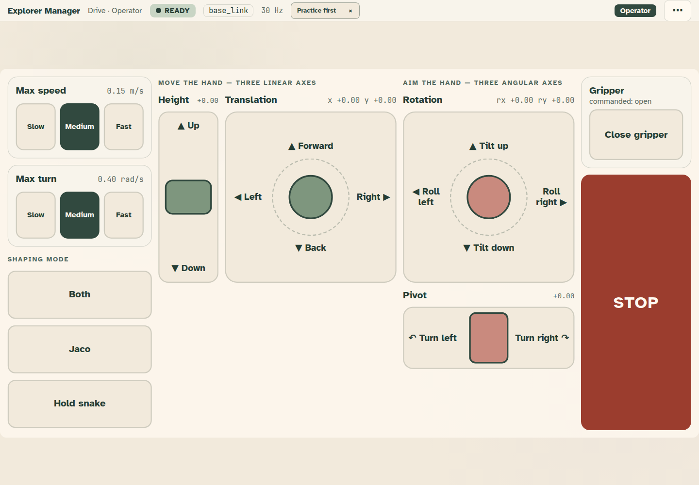

# Maintenance

This page is for operators and lab staff. It explains the maintenance menu in a running app: what it is for, how to
open it, what the arm does while it is open, what you can change there, and how to leave.

The full contract is in [the operator runtime guide](../operator-runtime.md#maintenance-sheet). For STOP, roles and
the kiosk bar, read [Operate safely](operate-safely.md) first.

> [!CAUTION]
> Maintenance holds the arm by sending zeros. It is not a STOP. It does not cancel a Go home, a Go to or any other
> pose target that is already running. When the arm must not move, press STOP, and know where the hardware
> emergency stop is.

## What maintenance is for

A running app shows only the controls and one status bar. Everything else is in the maintenance menu:

- other screens of the app,
- Settings (text size, colours, language, input method, timing),
- another role,
- practice,
- the supervisor mirror, Help, the Builder, and the way back to the library.

It is kept behind a deliberate gesture on purpose. A stray touch while the arm moves must not swap the controls
under the operator's hand.

## Step 1: open it

The menu button is **⋯**, at the right end of the top bar, after the role name.

How you open it depends on the role and on how you reach the controls:

| Role | How to open maintenance | Also |
| --- | --- | --- |
| **Operator** | Hold **⋯** for 1.5 seconds. A fill grows across the button. | A short tap only shows *Keep holding ⋯ to open the menu*. |
| **Bench** | Tap **⋯**. | Tapping the screen name opens the same menu. |
| **Lab** (Widget Lab) | Tap **⋯**. | Tapping the screen name opens the same menu. |
| **One switch** | Wait for the highlight to reach **⋯**, then press the switch. It opens at once. | This role also has dwell on: resting the pointer on **⋯** opens it too. |

Notes:

- On a keyboard, focus **⋯** and hold Enter or Space for 1.5 seconds.
- A hold stops if your finger slides off the button or you let go early. Start again.
- Under scan or dwell, a hold is never needed. Reaching **⋯** by switch or by resting on it is already deliberate.
- Whether a tap is enough is a setting of the role. In the Builder's role editor it is **A tap opens the menu (no
  hold); for roles that do not drive**. The shipped apps turn it on for every **Bench** and **Lab** role and leave
  it off for **Operator** and **One switch**.

## Step 2: what the arm does

When the menu opens, Bloom does three things, in this order:

1. It holds motion. From now on, any command that would move the arm is refused with **Robot held at zeros**.
2. It lets go of every control. Joysticks, sliders and latched controls return to rest.
3. It sends one zero twist to each teleop target this tablet moved since its last zero. After that, only zeros
   can go out.

`cartesian_manager` drops any input older than 0.2 seconds, so its output stays at zero while nothing is sent.

While the menu is open:

- A joystick still held under the menu cannot start motion again. Only releases get through.
- The gamepad is ignored.
- The top bar stays visible above the menu. The status chip reads **HELD FOR MAINTENANCE** and the rate reads
  **zeros held**.
- **STOP stays live**, above the menu, for touch, keyboard (it is part of the Tab loop), scan and dwell.

What maintenance does **not** do:

- It does not engage STOP. Nothing is latched in the backend.
- It does not cancel a pose target. A Go home or Go to that was already running keeps running. The bar shows
  **Going to a pose** while one is active. Press STOP to cancel it.
- It does not change the shaping mode, the speed limits, the command frame, or a manager behaviour (**Speed up on**,
  **Assist on**).
- It does not give up control of the robot. This tablet stays the one in control.

Settings and Practice hold the arm in the same way while they are open.

## Step 3: what you can do there

The menu opens as a sheet over the controls. From top to bottom:

**Screens.** The app's other screens, when it has more than one. The current one is marked. Choose one to go
straight to it; this closes the menu. Screens that belong to another role's layout are not listed: switch role to
reach them.

**Facts.** Six read-only facts: link (and *you control the robot* when this tablet owns it), publish rate, command
frame, profile and its layout, device class (and the gamepad, if one is connected), and the app. You can read them;
you cannot set them here. If the screen is shown smaller than it was designed, a warning says so.

**Actions.**

- **Settings** opens the settings for this role on this device. See below.
- **Switch role** needs its own 1.5 second hold (a scan or dwell press selects it directly). Then choose a role.
  Bloom opens that role's screen and remembers the choice on this device. It is shown only when the app has more
  than one role.
- **Reload this app** reloads Bloom and keeps your role.
- **Exit to library** ends the session and goes back to the list of apps.

**More.**

- **Practice** starts the guided practice. Its controls reach no robot.
- **Supervisor mirror** opens a read-only status view.
- **Edit this screen in the builder**, **Edit app**, **Help** and **Home**.
- **EN / ES / FR** changes the language at once and keeps it for this role on this device.

### Settings

Settings replaces the controls while it is open. You can change:

- **Display**: text size, **Colours** (the app's or role's palette, or one of six vetted palettes), language, and a
  sound on every press.
- **How you reach the controls**: input method (**Touch**, **Dwell**, **Scan**) and how a push moves (**Drag**,
  **Tap by tap**, **Keep going**).
- **Timing**: hold to activate, scan step, ignore repeats, joystick dead zone.
- **Practice offer**: show the *Start practice* offer in the bar when the app opens, or turn it off for this role.

**Try it** tests a press with the new settings. Nothing is sent.

Changes are a draft until you save. **Save and resume** keeps them and goes back to the controls. **Discard changes**
or Escape leaves without saving. Either way, you return to the controls, not to the menu.

Settings change how a person reaches the controls, never what the app sends to the robot.

## Step 4: leave

Choose **Resume operating** at the bottom of the sheet, **Close** at the top, or press Escape. All three do the same
thing: the menu closes and the controls work again.

Leaving sends nothing to the robot. The arm moves again only when a control sends a new push. A gamepad stick that was
pushed when the menu opened must come back to centre before it drives again.

Choosing a screen, a role, Settings, Practice, the supervisor mirror or Exit to library also closes the menu.

## Scan and dwell

Under **Scan**, the open sheet becomes the scan area, with STOP first and its own **SWITCH** button in the footer.
Settings, a screen, a role and **Resume operating** are all reachable by switch. The controls behind the sheet are
never scanned.

Under dwell, the sheet becomes the dwell area in the same way, and STOP still answers a dwell.

Some entries lead to pages with no scanner or dwell: **Exit to library**, **Supervisor mirror**, the two **Edit**
entries, **Help** and **Home**. They are skipped by scan and dwell, and the sheet says so. A caregiver opens them by
touch. Under **Switch role**, a role that does not use your input method is touch only too: a switch or dwell cannot
choose a role that would leave STOP out of its reach.

## STOP and maintenance

- STOP works while the menu, Settings or Practice is open.
- If you press STOP there, the chip reads **STOPPED**. STOPPED outranks **HELD FOR MAINTENANCE**.
- Leaving maintenance does not release STOP. Hold **HOLD TO RESUME** for one second, as usual. Resume needs control
  of the robot.
- You can open maintenance while stopped. Under scan or dwell, **⋯** stays reachable even when the screen is stopped
  or another tablet has control.

The chip shows one word, in this order: **STOPPED**, then **LINK DOWN** or **CONNECTING**, then **NOT IN CONTROL**,
then **HELD FOR MAINTENANCE**, then **READY**. So **HELD FOR MAINTENANCE** only shows when the link is up and this
tablet has control.

## Troubleshooting

**I cannot find the menu.** Look at the right end of the top bar, after the role name. On **Operator** and **One
switch**, a tap does nothing but show a hint: hold for 1.5 seconds and do not slide off. On a keyboard, hold Enter or
Space. Under scan, wait for the highlight to reach **⋯**. In Settings or Practice there is no **⋯**: save, discard or
finish practice first.

**The menu opened, but I cannot reach Exit to library, Help or Edit by switch or dwell.** That is on purpose. Those
pages have no scanner. Ask someone to tap them.

**The arm moved after I left maintenance.** Check, in this order:

1. Was a Go home, Go to or named pose running? Maintenance does not cancel it. Look for **Going to a pose** in the
   bar. Use STOP to cancel.
2. Was a control still pushed? A key still held down, or a gamepad stick pushed while the menu was open, can send a
   new push as soon as the menu closes.
3. Is another tablet driving? The chip would read **NOT IN CONTROL** on this tablet.

If none of these explains it, press STOP and check the command path with Bloom Debug and the
[bench card](../bench-card.md).

**My settings were not kept.**

- **Discard changes** and Escape do not save. Use **Save and resume**.
- Settings are saved in this browser, for this app and this role. Another tablet, another browser, a private window
  or cleared site data starts from the role's defaults.
- Each role has its own settings. After **Switch role**, you see that role's settings.

**The screen I want is not in the list.** It is the layout of another role. Use **Switch role**.

**There is no Switch role.** The app has only one role.
