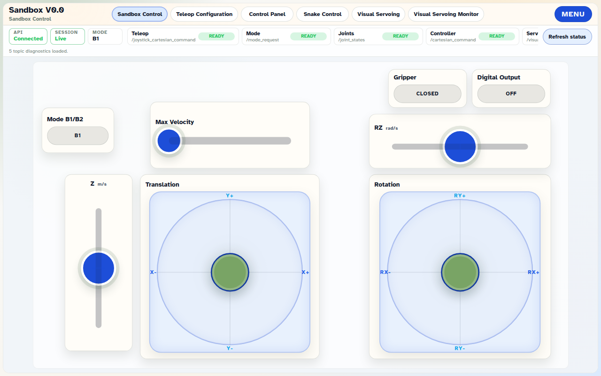
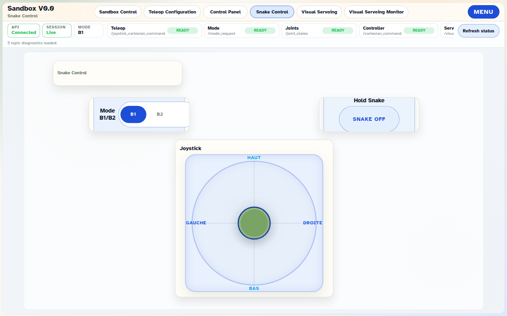
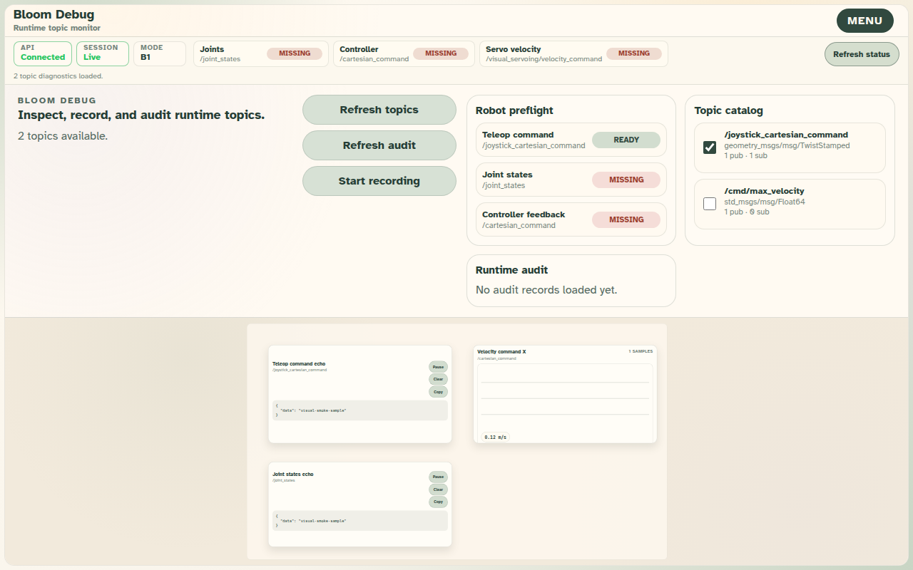

# 2026-09-01 Cartesian manager runtime and release readiness

Status: **accepted** for contract, bench, and release-hygiene level.
**Not** accepted for live robot behaviour: no robot was attached.

## Scope

Two pieces of work:

1. Moving Bloom's runtime onto the `cartesian_manager` contract, replacing the
   `sandbox_controller` path that left the Extender workspace manifest.
2. Closing the release-readiness gaps found while doing it.

## Environment

- Ubuntu 24.04.4 LTS, ROS 2 Jazzy, Python 3.12.3, Node 20.20.2.
- `cartesian_manager` built from `ISIR-EXTENDER/cartesian_manager@a166dc7`, run
  with `bringup/config/explorer_params.yaml`.
- No robot, no simulator. `/ee_pose`, `/ee_velocity` and `/joint_states` had no
  publisher, which is why runtime telemetry reads MISSING in the screenshots.

## Automated results

| Gate | Result |
| --- | --- |
| Backend suite | 186 passed |
| Frontend suites | 279 passed across 5 workspaces |
| Biome check | clean, 134 files |
| Production build | OK |
| `npm run audit:frontend` | pass |
| `visual:smoke` | pass |
| `validation:extender` | pass |
| `validation:frontend-backend` | pass |
| `validation:sandbox-runtime` | pass |
| `validation:sandbox-tablet` | pass |
| `validation:visual-servoing` | pass |
| `validation:petanque-parity` | pass |

## Bench results against a live manager

Bloom API started with `api run-ros`, joined the ROS graph as `/bloom_api`
alongside `/cartesian_manager`.

| Check | Observed |
| --- | --- |
| 40 teleop commands over the runtime WebSocket | 40 acks, target `/joystick_cartesian_command`, status `accepted` |
| Values arriving on `/cartesian_command` | `0.42 / -0.15 / 0.25`, unchanged from what Bloom sent |
| Valid mode request over HTTP | 200, published |
| `geometric/spiral` | 422, `unknown geometric mode 'spiral', expected one of both, jaco, snake` |
| Audit log | both the accept and the reject recorded |
| Normalization on the wire | `GEOMETRIC/Snake` -> `geometric/snake`, `Behaviour/Joint-Target/Home` -> `behaviour/joint_target/home` |

## Screenshots

The status strip reports `/joystick_cartesian_command` and `/mode_request`.
Both read MISSING because no ROS graph is attached during the visual smoke run.

Robot preflight and the topic catalog now describe the manager contract.

## What the screenshots caught that the tests did not

Three defects survived a green test suite and were only visible in rendered UI:

1. The runtime status strip still advertised `/teleop_cmd` and
   `/sandbox_controller/velocity_command`. Tests asserted the strip's behaviour,
   not the topics it named.
2. Bloom Debug's robot preflight and default recording selection still used the
   retired topics.
3. The Bloom Debug echo and plot widgets were still bound to them.

A fourth, on the wire rather than on screen: mode requests reached ROS
un-normalized. The manager normalizes internally, so it worked, and unit tests
with a fake publisher could not see it.

## Deliberately unchanged

- **Petanque** stays on `/teleop_cmd` and
  `/sandbox_controller/velocity_command`. Its stack is legacy and outside the new
  architecture, so `validation:petanque-parity` still asserts the old contract,
  and the backend keeps `/sandbox_controller/velocity_command` in its recording
  allowlist for it. Both are commented as such.
- Historical decision records (0071, 0073, 0074) and earlier validation records
  keep their original wording. They describe what was true when written.

## Not validated

- Live robot motion. Every Extender claim here is fixture, contract, or bench.
- The Z slider, rotation joystick, and joint-target actions were not exercised
  by hand in Bloom.
- One low severity `esbuild` advisory remains, affecting the Windows dev server
  only.

## Follow-up

1. Live Sandbox V0.0 pass against the Explorer simulation through
   `cartesian_manager`.
2. Petanque migration or retirement, which removes the last legacy topics.
3. `translation` and `orientation` behaviours when the manager gains them.
